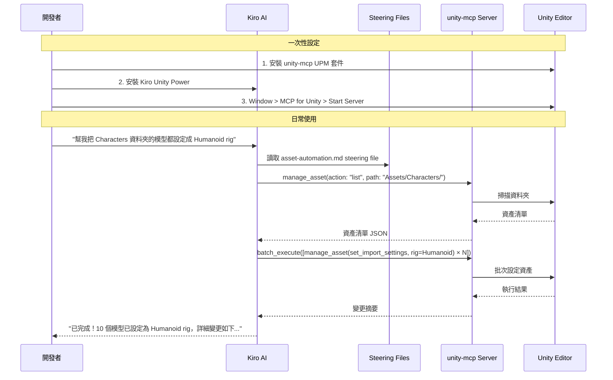
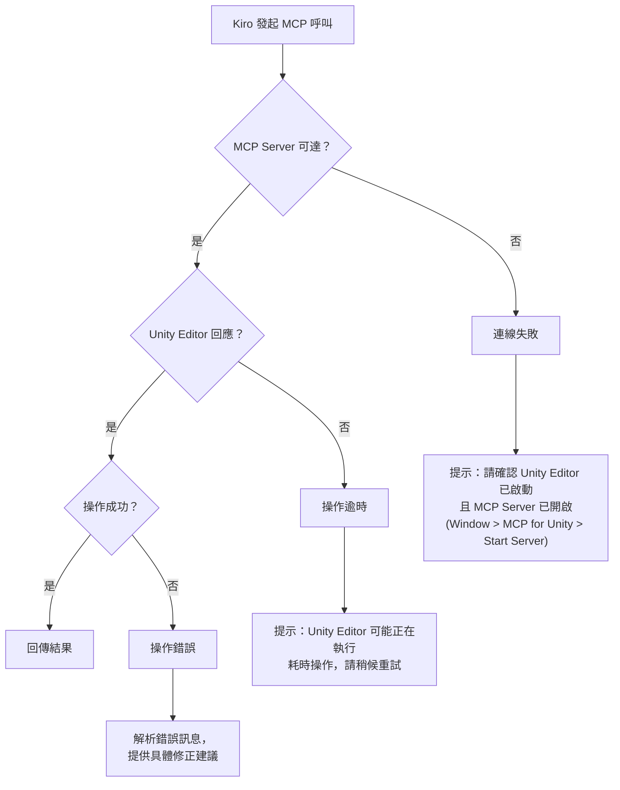

# 設計文件：Kiro Unity Power

## 概述

Kiro Unity Power 是一個 Kiro Power 套件，讓 Kiro 成為 Unity 開發的智慧大腦。開發者在 Kiro 中以自然語言下達指令，Kiro 透過 MCP（Model Context Protocol）遠端操控 Unity Editor，執行資產管理、場景建置、建置自動化、效能分析等十大核心功能。

本 Power 的核心價值不在於底層通訊管道（plumbing），而在於**領域智慧（domain intelligence）**——透過 steering files、workflow 知識與 Unity 最佳實踐，讓 Kiro 深度理解 Unity 開發流程，能夠將開發者的高階意圖轉化為精確的 MCP 工具呼叫序列。

### 架構核心

- **Kiro = 大腦**：開發者的主要互動介面，負責理解意圖、規劃執行策略、串接 MCP 工具呼叫
- **unity-mcp = 執行層**：開源專案 [CoplayDev/unity-mcp](https://github.com/CoplayDev/unity-mcp) 提供的 MCP server，橋接 Kiro 與 Unity Editor
- **Power 套件 = 智慧層**：POWER.md、steering files、預設範本，讓 Kiro「懂」Unity 開發

### 設計原則

1. **零摩擦（Zero Friction）**：安裝 Power + UPM 套件 + 啟動 MCP server，三步完成，無需雲端帳號
2. **Kiro 主導（Kiro-Centric）**：所有操作從 Kiro 發起，Unity Editor 是被操控的目標
3. **智慧優先（Intelligence First）**：Power 的價值在 steering files 與 workflow 知識，不在管道
4. **自然語言驅動（NL-Driven）**：開發者用自然語言描述意圖，Kiro 翻譯為 MCP 工具呼叫
5. **可組合（Composable）**：複雜工作流由多個 MCP 工具呼叫組合而成，透過 `batch_execute` 串接
6. **本地優先（Local First）**：所有核心功能在本地執行，Cloud_Assist 為可選的透明加速層

### 核心架構決策

| 決策 | 選擇 | 理由 |
|------|------|------|
| 執行層 | unity-mcp (開源) | 成熟的 MCP server，已提供完整的 Unity Editor 操控工具集 |
| 通訊協定 | MCP over HTTP (localhost:8080/mcp) | unity-mcp 原生支援，零配置 |
| 備用傳輸 | MCP over stdio (uvx) | unity-mcp 同時支援 stdio 模式 |
| 領域知識載體 | Steering files (.kiro/steering/) | Kiro 原生的知識注入機制 |
| 預設/範本格式 | JSON | 版本控制友好，團隊共享方便 |
| 工作流編排 | Kiro 自然語言 + batch_execute | 開發者描述意圖，Kiro 規劃工具呼叫序列 |

## 架構

### 高層架構圖

```mermaid
graph TB
    subgraph "Kiro IDE"
        Dev["開發者<br/>(自然語言)"]
        Kiro["Kiro AI 引擎"]
        
        subgraph "Kiro Unity Power 套件"
            PM["POWER.md<br/>(Power 說明文件)"]
            SF["Steering Files<br/>(.kiro/steering/)"]
            TPL["預設範本<br/>(JSON presets/scaffolds)"]
            MCP_CFG["MCP 配置<br/>(server URL)"]
        end
    end
    
    subgraph "MCP 通訊層"
        MCP_CLIENT["MCP Client<br/>(Kiro 內建)"]
        HTTP["HTTP Transport<br/>localhost:8080/mcp"]
    end
    
    subgraph "Unity Editor"
        MCP_SERVER["unity-mcp Server<br/>(UPM 套件)"]
        
        subgraph "MCP 工具集"
            T1["manage_asset"]
            T2["manage_scene"]
            T3["manage_gameobject"]
            T4["manage_components"]
            T5["manage_material"]
            T6["manage_script"]
            T7["manage_shader"]
            T8["manage_texture"]
            T9["manage_prefabs"]
            T10["manage_ui"]
            T11["manage_animation"]
            T12["manage_camera"]
            T13["manage_graphics"]
            T14["manage_packages"]
            T15["manage_editor"]
            T16["run_tests"]
            T17["read_console"]
            T18["batch_execute"]
            T19["create_script"]
            T20["find_gameobjects"]
        end
        
        subgraph "MCP 資源"
            R1["project_info"]
            R2["editor_state"]
            R3["gameobject"]
            R4["editor_selection"]
        end
    end
    
    Dev --> Kiro
    Kiro --> PM
    Kiro --> SF
    Kiro --> TPL
    Kiro --> MCP_CLIENT
    MCP_CLIENT --> HTTP
    HTTP --> MCP_SERVER
    MCP_SERVER --> T1 & T2 & T3 & T4 & T5 & T6 & T7 & T8 & T9 & T10
    MCP_SERVER --> T11 & T12 & T13 & T14 & T15 & T16 & T17 & T18 & T19 & T20
    MCP_SERVER --> R1 & R2 & R3 & R4
```



### 開發者工作流程



### 需求與 MCP 工具對應表

| 需求 | 主要 MCP 工具 | 輔助工具/資源 |
|------|--------------|--------------|
| 需求 1：資產設定自動化 | `manage_asset`, `manage_material`, `manage_texture`, `manage_shader` | `batch_execute`, `project_info` |
| 需求 2：場景建置加速 | `manage_scene`, `manage_gameobject`, `manage_components`, `manage_prefabs` | `batch_execute`, `manage_camera`, `manage_ui` |
| 需求 3：建置自動化 | `manage_editor` (build commands) | `read_console` |
| 需求 4：跨平台測試 | `run_tests` | `read_console` |
| 需求 5：工作流自動化 | `batch_execute` (串接多工具) | 所有工具皆可被串接 |
| 需求 6：效能分析 | `manage_graphics` (rendering stats) | `read_console`, `find_gameobjects` |
| 需求 7：程式碼品質 | `manage_script`, `create_script` | `read_console`, `project_info` |
| 需求 8：知識管理 | `project_info` | `manage_packages`, `manage_script` |
| 需求 9：平台相容性 | `manage_shader`, `manage_graphics`, `manage_packages` | `manage_asset`, `manage_editor` |
| 需求 10：資產依賴 | `manage_asset`, `find_gameobjects` | `manage_scene`, `project_info` |

## 元件與介面

### 1. Power 套件結構

Kiro Unity Power 套件的檔案結構：

```
kiro-unity-power/
├── POWER.md                          # Power 主文件，描述功能與使用方式
├── mcp.json                          # MCP server 配置
├── steering/
│   ├── unity-general.md              # Unity 開發通用知識與最佳實踐
│   ├── asset-automation.md           # 需求 1：資產設定自動化的領域知識
│   ├── scene-scaffolding.md          # 需求 2：場景建置加速的領域知識
│   ├── build-automation.md           # 需求 3：建置自動化的領域知識
│   ├── cross-platform-testing.md     # 需求 4：跨平台測試的領域知識
│   ├── workflow-automation.md        # 需求 5：工作流自動化的領域知識
│   ├── performance-analysis.md       # 需求 6：效能分析的領域知識
│   ├── code-quality.md              # 需求 7：程式碼品質的領域知識
│   ├── knowledge-management.md       # 需求 8：知識管理的領域知識
│   ├── platform-compatibility.md     # 需求 9：平台相容性的領域知識
│   └── asset-dependencies.md         # 需求 10：資產依賴管理的領域知識
└── templates/
    ├── presets/                       # 內建 Asset_Preset JSON 範本
    │   ├── 3d-character.json
    │   ├── 3d-environment.json
    │   ├── 2d-sprite.json
    │   ├── ui-texture.json
    │   └── audio-sfx.json
    ├── scaffolds/                     # 內建 Scene_Scaffold JSON 範本
    │   ├── 2d-platformer.json
    │   ├── 3d-first-person.json
    │   ├── ui-menu.json
    │   ├── open-world-base.json
    │   └── multiplayer-lobby.json
    ├── build-configs/                 # 內建建置配置範本
    │   ├── windows-dev.json
    │   ├── android-release.json
    │   ├── ios-release.json
    │   └── webgl-release.json
    ├── platform-profiles/             # 內建平台設定檔
    │   ├── ios.json
    │   ├── android.json
    │   ├── console.json
    │   └── webgl.json
    ├── architecture-rules/            # 內建架構規則
    │   ├── mvc-pattern.json
    │   ├── ecs-pattern.json
    │   └── scriptableobject-pattern.json
    └── workflows/                     # 內建工作流範本
        ├── asset-import-setup.json
        ├── build-and-deploy.json
        └── test-execution.json
```

### 2. MCP 配置（mcp.json）

```json
{
  "mcpServers": {
    "unity-mcp": {
      "url": "http://localhost:8080/mcp",
      "transport": "http"
    }
  }
}
```

備用 stdio 模式：

```json
{
  "mcpServers": {
    "unity-mcp": {
      "command": "uvx",
      "args": ["unity-mcp"],
      "transport": "stdio"
    }
  }
}
```

### 3. POWER.md 核心內容

POWER.md 是 Kiro 讀取的主文件，告訴 Kiro 這個 Power 能做什麼、如何使用 MCP 工具。核心結構：

```markdown
# Kiro Unity Power

## 概述
你現在具備透過 MCP 遠端操控 Unity Editor 的能力。

## 可用 MCP 工具
- manage_asset: 管理資產導入設定、搜尋資產、批次操作
- manage_scene: 建立/載入/儲存場景
- manage_gameobject: 建立/修改/刪除遊戲物件
- manage_components: 新增/移除/修改元件
- ...（完整工具清單與參數說明）

## 工作流指引
- 資產批次操作：先用 manage_asset list 掃描，再用 batch_execute 批次套用
- 場景建置：先用 manage_scene create，再用 manage_gameobject 逐層建立物件階層
- ...（每個需求的工作流指引）

## 預設範本
- templates/ 目錄下有預建的 JSON 範本，可直接使用或作為基礎修改
```

### 4. Steering Files 設計

每個 steering file 編碼特定領域的知識，指導 Kiro 如何有效使用 MCP 工具。

#### asset-automation.md（需求 1 範例）

```markdown
# 資產設定自動化 Steering

## 你的角色
你是 Unity 資產管線專家。當開發者要求批次設定資產時，你應該：

## 工作流程
1. 使用 manage_asset(action: "list") 掃描指定資料夾
2. 根據檔案副檔名與命名慣例判斷資產類型
3. 從 templates/presets/ 載入對應的 Asset_Preset
4. 使用 batch_execute 批次套用設定
5. 回報變更摘要

## 命名慣例規則
- *_char_*, *_character_* → 3D Character preset
- *_env_*, *_prop_* → 3D Environment preset
- *_ui_*, *_icon_* → UI Texture preset
- *_sfx_*, *_bgm_* → Audio preset

## MCP 工具用法
### 掃描資料夾
manage_asset(action: "list", path: "Assets/Characters/", recursive: true, filter: "*.fbx,*.obj")

### 設定模型導入參數
manage_asset(action: "set_import_settings", path: "Assets/Characters/hero.fbx", settings: {
  "rigType": "Humanoid",
  "materialImportMode": "ImportViaMaterialDescription",
  "meshCompression": "Medium"
})

### 批次執行
batch_execute(commands: [
  { "tool": "manage_asset", "args": { "action": "set_import_settings", ... } },
  ...
])

## 錯誤處理
- 若資產路徑不存在，告知開發者並建議正確路徑
- 若設定套用失敗，記錄失敗的資產並繼續處理其餘資產
- 套用完成後，列出成功與失敗的資產清單

## 最佳實踐
- Humanoid rig 適用於有骨架動畫的角色模型
- Generic rig 適用於非人形的動畫模型
- 環境模型通常不需要 rig，使用 None
- 貼圖壓縮：行動平台用 ASTC，桌面用 BC7
```

#### scene-scaffolding.md（需求 2 範例）

```markdown
# 場景建置加速 Steering

## 你的角色
你是 Unity 場景架構專家。當開發者要求快速搭建場景時，你應該：

## 工作流程
1. 確認開發者需要的場景類型
2. 從 templates/scaffolds/ 載入對應的 Scene_Scaffold
3. 使用 manage_scene 建立或開啟目標場景
4. 使用 manage_gameobject + manage_components 依照 scaffold 定義建立物件階層
5. 使用 find_gameobjects 檢查是否有命名衝突
6. 回報生成摘要

## MCP 工具呼叫序列（3D 第一人稱場景範例）
1. manage_scene(action: "create", name: "FPSLevel")
2. manage_gameobject(action: "create", name: "---Environment---")
3. manage_gameobject(action: "create", name: "Directional Light", components: ["Light"])
4. manage_gameobject(action: "create", name: "Terrain", components: ["Terrain", "TerrainCollider"])
5. manage_gameobject(action: "create", name: "---Player---")
6. manage_gameobject(action: "create", name: "FPSController", components: ["CharacterController"])
7. manage_camera(action: "create", name: "MainCamera", parent: "FPSController")
8. manage_ui(action: "create_canvas", name: "HUDCanvas")
9. manage_scene(action: "save")

## 衝突處理
- 使用 find_gameobjects 檢查目標場景中是否已有同名物件
- 若有衝突，詢問開發者：覆蓋、重新命名、或取消
```

### 5. 工具呼叫編排介面

Kiro 透過 steering files 學習如何將高階意圖分解為 MCP 工具呼叫序列。以下定義各需求的核心編排模式：

#### 資產批次操作模式（需求 1）

```
意圖: "把 Characters 資料夾的模型都設定成 Humanoid rig"
↓ Kiro 規劃
步驟 1: manage_asset(list, "Assets/Characters/", recursive=true, filter="*.fbx")
步驟 2: 載入 templates/presets/3d-character.json
步驟 3: batch_execute([manage_asset(set_import_settings, path=each, settings=preset) × N])
步驟 4: 彙整結果，回報變更摘要
```

#### 場景生成模式（需求 2）

```
意圖: "幫我建一個 3D 第一人稱場景"
↓ Kiro 規劃
步驟 1: 載入 templates/scaffolds/3d-first-person.json
步驟 2: manage_scene(create, "NewFPSScene")
步驟 3: batch_execute([manage_gameobject(create, ...) × N]) — 依 scaffold hierarchy 建立
步驟 4: manage_scene(save)
步驟 5: 回報生成摘要（物件數、元件清單）
```

#### 建置自動化模式（需求 3）

```
意圖: "幫我建置 Windows 版本"
↓ Kiro 規劃
步驟 1: 載入 templates/build-configs/windows-dev.json（或開發者自訂配置）
步驟 2: manage_editor(action: "build", target: "StandaloneWindows64", scenes: [...], outputPath: "...")
步驟 3: 輪詢 read_console() 取得建置進度與日誌
步驟 4: 若失敗，解析 console 日誌提供結構化錯誤摘要與修正建議
步驟 5: 回報建置結果
```

#### 效能分析模式（需求 6）

```
意圖: "分析目前場景的效能"
↓ Kiro 規劃
步驟 1: manage_graphics(action: "get_rendering_stats")
步驟 2: read_console() 收集效能相關日誌
步驟 3: find_gameobjects(filter: "high_poly OR complex_shader") 定位瓶頸物件
步驟 4: 比對指標與閾值（從 templates/ 或開發者自訂設定）
步驟 5: 生成 Performance_Report JSON，包含指標、瓶頸、最佳化建議
步驟 6: 回報分析結果
```

#### 程式碼品質模式（需求 7）

```
意圖: "檢查專案的程式碼架構"
↓ Kiro 規劃
步驟 1: project_info 取得專案結構
步驟 2: manage_script(action: "list") 取得所有 C# 腳本
步驟 3: manage_script(action: "read", path: each) 讀取腳本內容
步驟 4: 載入 templates/architecture-rules/ 中啟用的規則
步驟 5: Kiro 分析程式碼結構，比對架構規則
步驟 6: 生成違規報告（檔案路徑、行號、規則名稱、修正建議）
步驟 7: 若發現循環依賴，以文字描述循環路徑
```

#### 平台相容性模式（需求 9）

```
意圖: "檢查 Android 平台的相容性"
↓ Kiro 規劃
步驟 1: 載入 templates/platform-profiles/android.json
步驟 2: manage_shader(action: "list") 取得所有 Shader
步驟 3: manage_asset(action: "list", filter: "*.shader") 掃描 Shader 資產
步驟 4: manage_graphics(action: "get_settings") 取得圖形設定
步驟 5: Kiro 比對 Shader 功能與平台支援清單
步驟 6: manage_asset(action: "get_info") 估算資產記憶體用量
步驟 7: 生成相容性報告（錯誤/警告/建議三級分類）
```

#### 資產依賴分析模式（需求 10）

```
意圖: "分析 hero.fbx 的依賴關係"
↓ Kiro 規劃
步驟 1: manage_asset(action: "get_dependencies", path: "Assets/Characters/hero.fbx")
步驟 2: 遞迴分析每個依賴的依賴
步驟 3: 建構依賴樹 JSON
步驟 4: 偵測循環引用
步驟 5: 以文字描述依賴樹結構
```


## 資料模型

### 核心資料結構

所有預設與範本以 JSON 格式存放在 Power 套件的 `templates/` 目錄（內建）或 Unity 專案的 `Assets/KiroUnityPower/Config/` 目錄（使用者自訂）。

#### AssetPreset（資產預設）

```json
{
  "id": "string (GUID)",
  "name": "string",
  "description": "string",
  "assetType": "Model | Texture | Audio | Material",
  "isBuiltIn": "boolean",
  "config": {
    "modelImport": {
      "scaleFactor": "number",
      "meshCompression": "Off | Low | Medium | High",
      "generateColliders": "boolean",
      "rigType": "None | Generic | Humanoid",
      "animationType": "None | Legacy | Generic | Humanoid",
      "materialImportMode": "None | ImportViaMaterialDescription | ImportViaStandard",
      "normalMapEnabled": "boolean"
    },
    "textureImport": {
      "maxSize": "number",
      "compression": "None | LowQuality | NormalQuality | HighQuality",
      "textureType": "Default | NormalMap | Sprite | Lightmap",
      "filterMode": "Point | Bilinear | Trilinear",
      "generateMipMaps": "boolean"
    }
  },
  "namingPatterns": ["string (regex)"],
  "mcpToolMapping": {
    "primaryTool": "manage_asset",
    "action": "set_import_settings",
    "settingsMap": "config 中的欄位如何對應到 MCP 工具參數"
  },
  "createdAt": "ISO 8601",
  "updatedAt": "ISO 8601"
}
```

#### SceneScaffold（場景腳手架）

```json
{
  "id": "string (GUID)",
  "name": "string",
  "description": "string",
  "category": "2D | 3D | UI | Multiplayer",
  "isBuiltIn": "boolean",
  "hierarchy": [
    {
      "name": "string",
      "tag": "string",
      "layer": "string",
      "components": [
        {
          "typeName": "string (fully qualified)",
          "properties": { "key": "value" }
        }
      ],
      "children": ["(recursive)"],
      "mcpTool": "manage_gameobject | manage_camera | manage_ui",
      "mcpArgs": { "對應的 MCP 工具參數" }
    }
  ],
  "requiredPackages": ["string (UPM package name)"],
  "createdAt": "ISO 8601"
}
```

#### BuildConfig（建置配置）

```json
{
  "id": "string (GUID)",
  "name": "string",
  "target": "StandaloneWindows64 | Android | iOS | WebGL",
  "scenes": ["string (scene path)"],
  "outputPath": "string",
  "options": {
    "development": "boolean",
    "allowDebugging": "boolean",
    "compression": "None | Lz4 | Lz4HC",
    "scriptingBackend": "Mono | IL2CPP"
  },
  "mcpToolMapping": {
    "primaryTool": "manage_editor",
    "action": "build",
    "progressTool": "read_console"
  },
  "useCloudAssist": "boolean",
  "createdAt": "ISO 8601"
}
```

#### WorkflowTemplate（工作流範本）

```json
{
  "id": "string (GUID)",
  "name": "string",
  "description": "string",
  "isBuiltIn": "boolean",
  "steps": [
    {
      "id": "string",
      "name": "string",
      "mcpTool": "string (MCP tool name)",
      "mcpAction": "string",
      "mcpArgs": { "key": "value" },
      "dependsOn": ["string (step id)"],
      "onFailure": "pause | skip | abort"
    }
  ],
  "createdAt": "ISO 8601"
}
```

#### PerformanceThresholds（效能閾值設定）

```json
{
  "drawCalls": { "warning": "number", "error": "number" },
  "gcAllocation": { "warning": "number (bytes)", "error": "number" },
  "shaderComplexity": { "warning": "number", "error": "number" },
  "frameRate": { "warningBelow": "number", "errorBelow": "number" },
  "customThresholds": { "metricName": { "warning": "number", "error": "number" } }
}
```

#### PerformanceReport（效能報告）

```json
{
  "id": "string (GUID)",
  "timestamp": "ISO 8601",
  "metrics": {
    "drawCalls": { "average": "number", "peak": "number" },
    "gcAllocation": { "average": "number (bytes)", "peak": "number" },
    "shaderComplexity": { "average": "number", "peak": "number" },
    "frameRate": { "average": "number", "min": "number" }
  },
  "bottlenecks": [
    {
      "metric": "string",
      "objectPath": "string (hierarchy path)",
      "value": "number",
      "suggestion": "string"
    }
  ],
  "thresholdsUsed": "PerformanceThresholds"
}
```

#### ArchitectureRule（架構規則）

```json
{
  "id": "string (GUID)",
  "name": "string",
  "description": "string",
  "isBuiltIn": "boolean",
  "enabled": "boolean",
  "pattern": "MVC | ECS | ScriptableObject | Custom",
  "rules": [
    {
      "type": "NamingConvention | LayerDependency | InheritanceConstraint | CyclicDependency",
      "config": { "key": "value" }
    }
  ]
}
```

#### PlatformProfile（平台設定檔）

```json
{
  "id": "string (GUID)",
  "name": "string",
  "platform": "iOS | Android | Console | WebGL",
  "isBuiltIn": "boolean",
  "checks": {
    "shaderFeatures": {
      "unsupported": ["string"],
      "alternatives": { "feature": "replacement" }
    },
    "memoryBudget": {
      "maxTextureMB": "number",
      "maxMeshMB": "number",
      "maxAudioMB": "number",
      "maxTotalMB": "number"
    },
    "scriptingConstraints": {
      "disallowedAPIs": ["string"],
      "requiredDefines": ["string"]
    }
  }
}
```

#### DependencyTree（依賴關係樹）

```json
{
  "rootAsset": "string (asset path)",
  "nodes": [
    {
      "assetPath": "string",
      "assetType": "string",
      "dependencies": ["string (asset path)"],
      "referencedBy": ["string (asset path)"]
    }
  ],
  "circularReferences": [
    {
      "path": ["string (asset path)"]
    }
  ]
}
```

#### KnowledgeEntry（知識庫條目）

```json
{
  "id": "string (GUID)",
  "title": "string",
  "content": "string (markdown)",
  "tags": ["string"],
  "relatedAssets": ["string (asset path or script GUID)"],
  "author": "string",
  "createdAt": "ISO 8601",
  "updatedAt": "ISO 8601",
  "status": "Active | NeedsReview",
  "reviewDeadline": "ISO 8601 (updatedAt + 180 days)"
}
```

### 資料儲存策略

| 資料類型 | 內建位置（Power 套件） | 自訂位置（Unity 專案） | 格式 |
|----------|----------------------|----------------------|------|
| Asset_Preset | `templates/presets/` | `Assets/KiroUnityPower/Config/Presets/` | JSON |
| Scene_Scaffold | `templates/scaffolds/` | `Assets/KiroUnityPower/Config/Scaffolds/` | JSON |
| Build_Config | `templates/build-configs/` | `Assets/KiroUnityPower/Config/Builds/` | JSON |
| Workflow_Template | `templates/workflows/` | `Assets/KiroUnityPower/Config/Workflows/` | JSON |
| Architecture_Rule | `templates/architecture-rules/` | `Assets/KiroUnityPower/Config/Rules/` | JSON |
| Platform_Profile | `templates/platform-profiles/` | `Assets/KiroUnityPower/Config/Platforms/` | JSON |
| Knowledge_Base | — | `Assets/KiroUnityPower/Knowledge/` | JSON + Markdown |
| Performance_Report | — | `Assets/KiroUnityPower/Reports/` | JSON |
| Performance_Thresholds | — | `Assets/KiroUnityPower/Config/thresholds.json` | JSON |

內建範本為唯讀，開發者可複製到自訂位置後修改。Kiro 在載入時優先使用自訂位置的檔案，若不存在則 fallback 到內建範本。


## 正確性屬性（Correctness Properties）

*屬性（Property）是一種在系統所有合法執行中都應成立的特徵或行為——本質上是對系統應做之事的形式化陳述。屬性是人類可讀規格與機器可驗證正確性保證之間的橋樑。*

### Property 1: 資產預設套用完整性（Preset Application Completeness）

*For any* AssetPreset 和任意一組支援的資產檔案路徑，將該 Preset 透過 MCP batch_execute 套用後，對每個資產呼叫 manage_asset(get_import_settings) 取得的參數值，都應等於 Preset 中定義的對應值。

**Validates: Requirements 1.1**

### Property 2: 資產類型偵測正確性（Asset Type Detection by Naming Pattern）

*For any* 資產檔案路徑，若該檔名匹配某個 AssetPreset 的 `namingPatterns` 中的任一正則表達式，則建議函式應回傳該 Preset；若不匹配任何 Pattern，則不應建議任何 Preset。

**Validates: Requirements 1.2**

### Property 3: 設定實體 CRUD 往返（Config Entity CRUD Round-Trip）

*For any* 設定實體類型（AssetPreset、SceneScaffold、WorkflowTemplate、ArchitectureRule、PlatformProfile、KnowledgeEntry），將實體序列化為 JSON 寫入檔案後再反序列化載入，應得到與原始資料等價的實體；刪除檔案後再載入應回傳空值。

**Validates: Requirements 1.3, 2.3, 5.1, 7.4, 9.6, 8.1**

### Property 4: 變更摘要正確性（Change Summary Accuracy）

*For any* 資產的原始參數狀態與 AssetPreset 的設定，套用後產生的變更摘要應精確列出所有值不同的參數項目，且不包含值相同的參數。

**Validates: Requirements 1.4**

### Property 5: 錯誤回復原子性（Error Rollback Atomicity）

*For any* 資產，若 MCP 工具呼叫在套用 AssetPreset 過程中回傳錯誤，該資產的所有參數應回復至套用前的狀態，且錯誤原因應被記錄在回應中。

**Validates: Requirements 1.5**

### Property 6: 資料夾掃描完整性（Folder Scan Completeness）

*For any* 資料夾結構（由 manage_asset list 回傳），過濾邏輯應保留所有支援類型的資產檔案（.fbx, .obj, .png, .jpg, .wav, .mp3, .mat, .shader 等），且排除所有不支援的檔案類型。

**Validates: Requirements 1.6**

### Property 7: 場景腳手架 MCP 呼叫轉譯正確性（Scaffold-to-MCP Translation）

*For any* SceneScaffold 定義，轉譯產生的 MCP 工具呼叫序列（manage_gameobject、manage_components、manage_camera、manage_ui）應與 Scaffold 的 hierarchy 結構一一對應，包含所有指定的物件名稱、元件類型與屬性值。

**Validates: Requirements 2.2**

### Property 8: 場景命名衝突偵測（Scene Name Conflict Detection）

*For any* SceneScaffold 定義和目標場景中已存在的物件名稱集合，衝突偵測應回傳所有 Scaffold 中與場景中同名的物件，且不遺漏任何衝突。

**Validates: Requirements 2.5**

### Property 9: 生成摘要一致性（Generation Summary Consistency）

*For any* SceneScaffold 生成操作，生成摘要中報告的物件數量應等於 Scaffold hierarchy 中定義的物件總數（含遞迴子物件），元件清單應與 hierarchy 中所有 components 的聯集一致。

**Validates: Requirements 2.4**

### Property 10: 建置日誌錯誤解析（Build Log Error Parsing）

*For any* 包含已知錯誤模式的建置日誌文字（由 read_console 取得），錯誤解析器應提取出所有錯誤訊息，並為每個錯誤提供結構化的摘要（含錯誤類型、檔案位置）與修正建議。

**Validates: Requirements 3.4**

### Property 11: 建置配置多組共存（Multiple Build Configs Coexistence）

*For any* 專案中的多組 BuildConfig JSON 檔案，每組配置應可獨立載入且其內容互不影響；修改一組配置不應改變其他配置的內容。

**Validates: Requirements 3.3**

### Property 12: Cloud_Assist 路由正確性（Cloud_Assist Routing）

*For any* 建置或測試操作，當配置中 `useCloudAssist` 為 true 時，Kiro 應將任務路由至雲端執行路徑；為 false 時，應使用本地 MCP 工具呼叫路徑。

**Validates: Requirements 3.5, 4.3**

### Property 13: 測試結果結構完整性（Test Result Structure per Platform）

*For any* 跨平台測試結果（由 run_tests MCP 工具回傳），每個目標平台的結果應包含通過率數值與失敗測試案例清單；若任一裝置有測試失敗，該裝置應被標記並附帶失敗日誌。

**Validates: Requirements 4.2, 4.5**

### Property 14: 測試套件格式轉換往返（Test Suite Format Round-Trip）

*For any* 有效的 Unity Test Framework 測試套件定義，轉換為 Cloud_Assist 可執行格式後再轉換回來，應產生與原始定義等價的測試套件。

**Validates: Requirements 4.6**

### Property 15: 工作流步驟執行順序（Workflow Step Execution Order）

*For any* WorkflowTemplate，Kiro 編排的 MCP 工具呼叫序列中，每個步驟應在其所有 `dependsOn` 步驟完成後才開始執行。

**Validates: Requirements 5.2**

### Property 16: 工作流進度計算（Workflow Progress Calculation）

*For any* 包含 N 個步驟的 WorkflowTemplate，完成第 K 個步驟後，進度百分比應為 K/N × 100。

**Validates: Requirements 5.3**

### Property 17: 工作流失敗暫停（Workflow Failure Pause）

*For any* WorkflowTemplate 執行中，若某步驟的 MCP 工具呼叫回傳錯誤，Kiro 應暫停在該步驟，後續步驟不應被執行，且應提供重試、跳過、中止三個選項。

**Validates: Requirements 5.4**

### Property 18: 工作流依賴驗證（Workflow Dependency Validation）

*For any* WorkflowTemplate，若步驟 B 的 `dependsOn` 包含步驟 A，但 B 在步驟列表中排在 A 之前且無法透過拓撲排序解決，則依賴驗證應回傳失敗。

**Validates: Requirements 5.6**

### Property 19: 效能報告完整性與閾值建議（Performance Report Completeness and Threshold Suggestions）

*For any* 效能分析資料（由 manage_graphics 和 read_console 取得），生成的 PerformanceReport 應包含 Draw Calls、GC Allocation、Shader 複雜度與幀率四項指標；且對於每個超出閾值的指標，應提供非空的最佳化建議文字。

**Validates: Requirements 6.1, 6.3**

### Property 20: 自訂閾值持久化（Custom Threshold Persistence）

*For any* 自訂的 PerformanceThresholds 設定，序列化為 JSON 儲存後再反序列化載入，應得到相同的閾值值；且後續的效能報告應使用自訂閾值而非預設值進行比對。

**Validates: Requirements 6.4**

### Property 21: 瓶頸定位正確性（Bottleneck Localization）

*For any* PerformanceReport 中標記為超出閾值的指標，透過 find_gameobjects 或 manage_script 定位的結果應回傳至少一個造成該指標異常的場景物件或腳本路徑。

**Validates: Requirements 6.6**

### Property 22: 架構違規報告完整性（Architecture Violation Report Completeness）

*For any* C# 腳本內容與啟用的 ArchitectureRule 集合，Kiro 分析產生的違規報告中每個違規項目應包含檔案路徑、行號、違規規則名稱與修正建議四個欄位，且不遺漏任何違反規則的程式碼。

**Validates: Requirements 7.2, 7.3**

### Property 23: 增量式檢查一致性（Incremental Check Consistency）

*For any* 被修改的 C# 腳本檔案，增量式架構檢查對該檔案產生的違規結果應與完整檢查對同一檔案產生的結果一致。

**Validates: Requirements 7.5**

### Property 24: 程式碼循環依賴偵測（Code Cyclic Dependency Detection）

*For any* 包含已知循環依賴的程式碼依賴圖，循環偵測應找出所有循環路徑，且不將非循環路徑誤報為循環。

**Validates: Requirements 7.6**

### Property 25: API 變更比對正確性（API Change Detection）

*For any* 專案中使用的 API 集合與新版本的變更清單，比對結果應包含所有在變更清單中出現且專案有使用的 API，且不包含專案未使用的 API。

**Validates: Requirements 8.2**

### Property 26: 知識庫搜尋相關性（Knowledge Base Search Relevance）

*For any* KnowledgeEntry 集合與搜尋關鍵字，搜尋結果應包含所有標題或標籤匹配該關鍵字的條目，且結果按相關性分數降序排列。

**Validates: Requirements 8.4**

### Property 27: 資產關聯文件查詢（Asset-Related Document Lookup）

*For any* 腳本或元件的路徑/GUID，查詢 Knowledge_Base 應回傳所有 `relatedAssets` 包含該路徑/GUID 的條目，且不遺漏任何匹配條目。

**Validates: Requirements 8.5**

### Property 28: 文件過期標記（Document Staleness Detection）

*For any* KnowledgeEntry，若 `updatedAt` 距今超過 180 天，其 `status` 應為 `NeedsReview`；若未超過 180 天，其 `status` 應為 `Active`。

**Validates: Requirements 8.6**

### Property 29: 平台相容性檢查與嚴重等級分類（Platform Compatibility Check with Severity Classification）

*For any* 專案資產集合與 PlatformProfile，相容性檢查應識別所有使用了該平台不支援功能的資產，且每個問題應被分類為錯誤（建置將失敗）、警告（可能在特定裝置上出問題）或建議（最佳化機會）三個等級之一。

**Validates: Requirements 9.2, 9.3**

### Property 30: Shader 替代方案建議（Shader Alternative Suggestion）

*For any* 使用了目標平台不支援 Shader 功能的資產，相容性報告應列出該不支援功能的名稱與 PlatformProfile 中定義的替代方案。

**Validates: Requirements 9.4**

### Property 31: 記憶體預算檢查（Memory Budget Check）

*For any* 資產集合與 PlatformProfile 的記憶體預算設定，所有估算大小超出對應類別預算的資產應被標記，且標記應包含實際估算大小與預算上限。

**Validates: Requirements 9.5**

### Property 32: 依賴關係樹完整性（Dependency Tree Completeness）

*For any* 資產及其已知的依賴關係圖（由 manage_asset get_dependencies 遞迴取得），產生的依賴樹應包含所有直接與間接依賴，且不遺漏任何路徑。

**Validates: Requirements 10.1**

### Property 33: 刪除影響與場景引用分析（Delete Impact and Scene Reference Analysis）

*For any* 資產，刪除影響分析應回傳所有直接或間接依賴該資產的項目清單，包含所有引用該資產的場景路徑。

**Validates: Requirements 10.3, 10.5**

### Property 34: AssetBundle 重複偵測（AssetBundle Duplication Detection）

*For any* AssetBundle 配置集合，若兩個或以上的 Bundle 包含相同的資產路徑，重複偵測應回傳所有重複項目及其所屬的 Bundle 名稱。

**Validates: Requirements 10.4**

### Property 35: 孤立資產偵測（Orphaned Asset Detection）

*For any* 專案的資產引用關係圖，孤立資產偵測應回傳所有入度為零（不被任何其他資產或場景引用）的資產，且不包含被引用的資產。

**Validates: Requirements 10.2**

### Property 36: 資產循環引用偵測（Asset Circular Reference Detection）

*For any* 包含已知循環引用的資產依賴圖，循環偵測應找出所有循環路徑，且不將非循環路徑誤報為循環。

**Validates: Requirements 10.6**


## 錯誤處理

### 錯誤處理策略

由於 Kiro 透過 MCP 遠端操控 Unity Editor，錯誤處理的核心挑戰在於 MCP 連線的可靠性與 Unity 端操作的原子性。系統採用分層錯誤處理策略，確保所有錯誤都有明確的回饋路徑，不會靜默失敗。

### MCP 連線錯誤



### 錯誤分類

| 類別 | 範例 | 處理方式 |
|------|------|----------|
| MCP 連線失敗 | Server 未啟動、網路不通 | 提示開發者檢查 Unity Editor 與 MCP Server 狀態 |
| MCP 操作逾時 | Unity 正在編譯、建置中 | 等待並重試，告知開發者 Unity 可能正忙 |
| MCP 工具錯誤 | 資產路徑不存在、參數無效 | 解析錯誤訊息，建議正確的路徑或參數 |
| 資產操作錯誤 | Preset 套用失敗、檔案鎖定 | 記錄失敗的資產，繼續處理其餘資產，最後彙報 |
| 建置錯誤 | 編譯失敗、缺少依賴 | 解析 read_console 日誌，提供結構化錯誤摘要 |
| Cloud_Assist 錯誤 | 網路逾時、認證失敗 | 降級至本地 MCP 執行，通知使用者 |
| 工作流錯誤 | 步驟執行失敗 | 暫停工作流，提供重試/跳過/中止選項 |
| 範本載入錯誤 | JSON 格式錯誤、檔案不存在 | 回退至內建範本，告知開發者自訂範本有問題 |

### 批次操作的部分失敗處理

當 batch_execute 中部分操作失敗時：

1. 記錄每個操作的成功/失敗狀態
2. 繼續執行剩餘操作（不因單一失敗中斷整批）
3. 最終彙報：成功 N 個、失敗 M 個、失敗原因清單
4. 對於需要原子性的操作（如 Preset 套用），失敗時回復該資產至原始狀態

### MCP 連線健康檢查

Kiro 在執行任何 MCP 操作前，應先進行輕量級健康檢查：

1. 嘗試讀取 `project_info` 資源
2. 若成功，確認 MCP 連線正常
3. 若失敗，提示開發者：
   - 確認 Unity Editor 已開啟
   - 確認 MCP Server 已啟動（Window > MCP for Unity > Start Server）
   - 確認 localhost:8080 未被其他程式佔用

### Cloud_Assist 降級策略

- Cloud_Assist 的所有錯誤都不應阻斷開發者的工作流程
- 網路不可用或服務異常時，自動降級至本地 MCP 執行
- 降級時告知開發者已切換至本地模式
- 本地模式下所有核心功能（除雲端建置與裝置測試外）均可正常運作


## 測試策略

### 雙軌測試方法

本專案採用單元測試與屬性測試（Property-Based Testing）並行的雙軌策略：

- **單元測試**：驗證特定範例、邊界條件與錯誤情境
- **屬性測試**：驗證跨所有輸入的通用屬性

兩者互補，單元測試捕捉具體的 bug，屬性測試驗證通用的正確性。

### 測試範圍

由於 Kiro Unity Power 是一個 Kiro Power 套件（主要由 steering files、JSON 範本、MCP 配置組成），可測試的邏輯集中在：

1. **JSON 範本的序列化/反序列化**：所有 preset、scaffold、config 的 CRUD 往返
2. **命名模式匹配邏輯**：資產類型偵測的正則表達式匹配
3. **變更摘要計算**：比對原始狀態與目標狀態的 diff 邏輯
4. **資料夾掃描過濾**：支援/不支援檔案類型的過濾邏輯
5. **Scaffold-to-MCP 轉譯**：將 scaffold JSON 轉換為 MCP 工具呼叫序列
6. **建置日誌解析**：從 console 日誌中提取錯誤與建議
7. **工作流依賴驗證與排序**：DAG 拓撲排序與驗證
8. **效能閾值比對**：指標值與閾值的比對與報告生成
9. **相容性檢查邏輯**：Shader 功能比對、記憶體預算計算
10. **依賴圖分析**：依賴樹建構、孤立偵測、循環偵測
11. **知識庫搜尋與過期偵測**：關鍵字匹配、日期計算

### 測試框架

| 類型 | 框架 | 理由 |
|------|------|------|
| 單元測試 | Jest | Power 套件的邏輯以 TypeScript/JavaScript 實作，Jest 為標準選擇 |
| 屬性測試 | fast-check | 成熟的 JavaScript/TypeScript 屬性測試庫，與 Jest 無縫整合 |

### 屬性測試配置

- 每個屬性測試最少執行 **100 次迭代**
- 每個屬性測試必須以註解標記對應的設計文件屬性
- 標記格式：`// Feature: kiro-unity-power, Property {number}: {property_text}`
- 每個正確性屬性由**單一**屬性測試實作

### 測試分類

#### 屬性測試（Property Tests）

每個正確性屬性（Property 1-36）對應一個屬性測試。以下為關鍵屬性測試的實作策略：

| 屬性 | 生成器策略 | 驗證方式 |
|------|-----------|----------|
| P1: Preset 套用完整性 | 隨機生成 AssetPreset JSON 與模擬資產狀態 | 比對套用後的參數與 Preset 定義 |
| P2: 命名模式匹配 | 隨機生成檔名與正則表達式 | 驗證匹配結果與 RegExp.test() 一致 |
| P3: CRUD 往返 | 隨機生成各類設定實體 JSON | 序列化→反序列化→比對等價性 |
| P4: 變更摘要 | 隨機生成原始狀態與目標狀態 | 驗證 diff 結果的精確性 |
| P6: 資料夾掃描 | 隨機生成檔案路徑清單（含支援與不支援類型） | 驗證過濾結果集合的精確性 |
| P7: Scaffold 轉譯 | 隨機生成 SceneScaffold JSON | 驗證產生的 MCP 呼叫序列與 hierarchy 一致 |
| P10: 日誌解析 | 隨機生成含已知錯誤模式的日誌文字 | 驗證所有錯誤被提取 |
| P14: 測試套件轉換 | 隨機生成 Unity Test 定義 | 轉換→反轉換→比對等價性 |
| P15: 工作流執行順序 | 隨機生成 DAG 結構的工作流 | 驗證拓撲排序正確性 |
| P18: 依賴驗證 | 隨機生成含非法依賴的工作流 | 驗證驗證器拒絕非法配置 |
| P24: 循環依賴偵測 | 隨機生成含已知循環的有向圖 | 驗證所有循環被找出 |
| P26: 知識庫搜尋 | 隨機生成 KnowledgeEntry 集合與關鍵字 | 驗證搜尋結果的完整性與排序 |
| P28: 文件過期 | 隨機生成不同日期的 KnowledgeEntry | 驗證 180 天閾值判斷 |
| P29: 相容性檢查 | 隨機生成資產集合與 PlatformProfile | 驗證問題識別與分類 |
| P32: 依賴樹 | 隨機生成資產依賴圖 | 驗證遍歷完整性 |
| P35: 孤立資產 | 隨機生成引用關係圖 | 驗證入度為零的節點集合 |
| P36: 循環引用 | 隨機生成含已知循環的有向圖 | 驗證所有循環被找出 |

#### 單元測試（Unit Tests）

單元測試聚焦於：

- **具體範例**：內建 Preset 的 JSON 結構正確性、內建 Scaffold 的 hierarchy 完整性
- **邊界條件**：空資料夾掃描、零步驟工作流、所有指標都在閾值內的效能報告、空的依賴圖
- **錯誤情境**：無效的 JSON 範本載入、MCP 連線失敗模擬、不存在的資產路徑
- **MCP 呼叫驗證**：驗證特定操作產生正確的 MCP 工具名稱與參數

#### 範例測試（Example Tests）

以下驗收條件以具體範例測試驗證：

- 2.1：驗證內建 Scene_Scaffold 至少有 5 種（2D 平台、3D 第一人稱、UI 選單、開放世界基礎、多人遊戲大廳）
- 3.2：驗證觸發建置時產生正確的 manage_editor MCP 呼叫
- 3.6：驗證 Cloud_Assist 建置狀態輪詢間隔為 30 秒
- 3.7：驗證 Cloud_Assist 建置完成後觸發產物下載
- 4.4：驗證 Cloud_Assist 測試結果包含螢幕截圖引用
- 5.5：驗證內建 Workflow_Template 至少有 3 種（資產導入與設定、建置與部署、測試執行）
- 7.1：驗證預設 Architecture_Rule 集合包含 MVC、ECS、ScriptableObject 模式
- 9.1：驗證四個平台（iOS、Android、Console、WebGL）各有對應的 Platform_Profile
- 9.7：驗證切換建置平台時自動觸發相容性檢查的 MCP 呼叫序列

### 測試目錄結構

```
tests/
├── unit/
│   ├── presets/
│   │   ├── preset-crud.test.ts
│   │   └── preset-application.test.ts
│   ├── scaffolds/
│   │   ├── scaffold-crud.test.ts
│   │   └── scaffold-translation.test.ts
│   ├── build/
│   │   ├── build-config.test.ts
│   │   └── build-log-parser.test.ts
│   ├── workflow/
│   │   ├── workflow-engine.test.ts
│   │   └── workflow-validation.test.ts
│   ├── performance/
│   │   └── performance-report.test.ts
│   ├── code-quality/
│   │   └── architecture-check.test.ts
│   ├── knowledge/
│   │   └── knowledge-base.test.ts
│   ├── platform/
│   │   └── compatibility-check.test.ts
│   ├── dependencies/
│   │   └── dependency-analysis.test.ts
│   └── mcp/
│       ├── connection-health.test.ts
│       └── tool-call-generation.test.ts
├── property/
│   ├── preset-properties.test.ts
│   ├── scaffold-properties.test.ts
│   ├── config-crud-roundtrip.test.ts
│   ├── workflow-properties.test.ts
│   ├── performance-properties.test.ts
│   ├── compatibility-properties.test.ts
│   ├── dependency-graph-properties.test.ts
│   ├── knowledge-search-properties.test.ts
│   └── build-log-parser-properties.test.ts
└── integration/
    └── mcp-integration.test.ts
```
