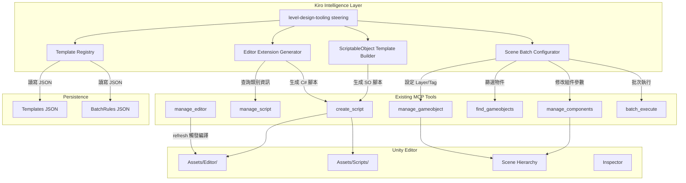
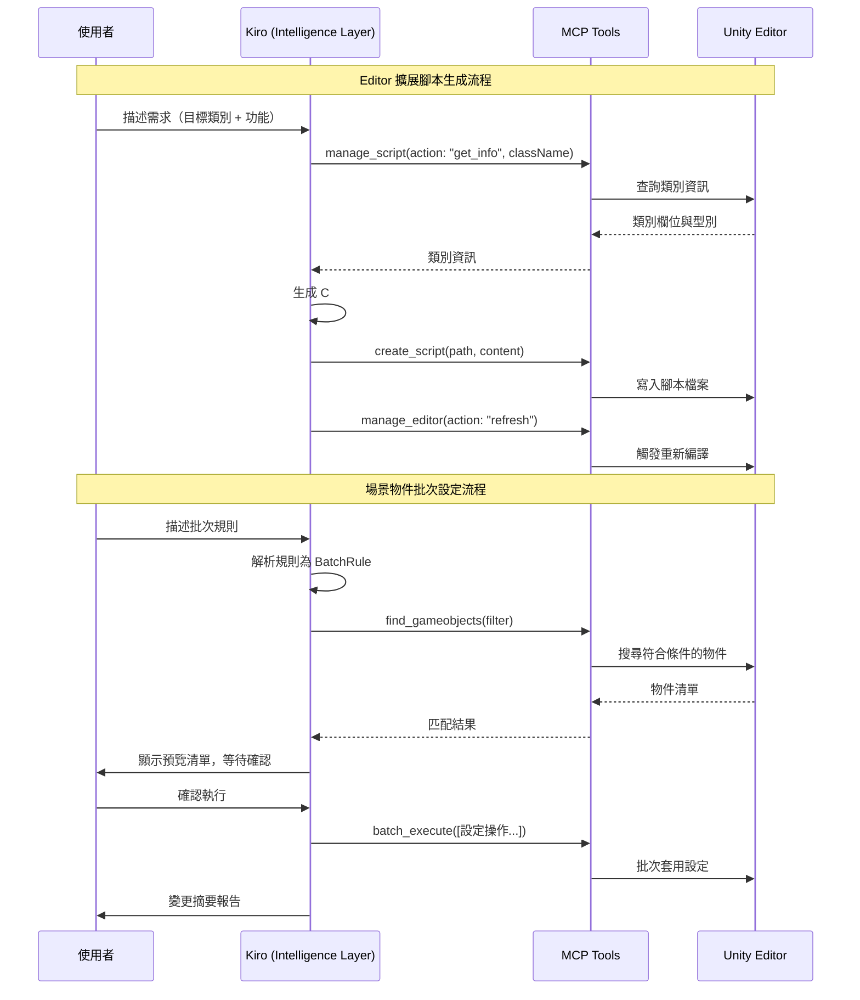
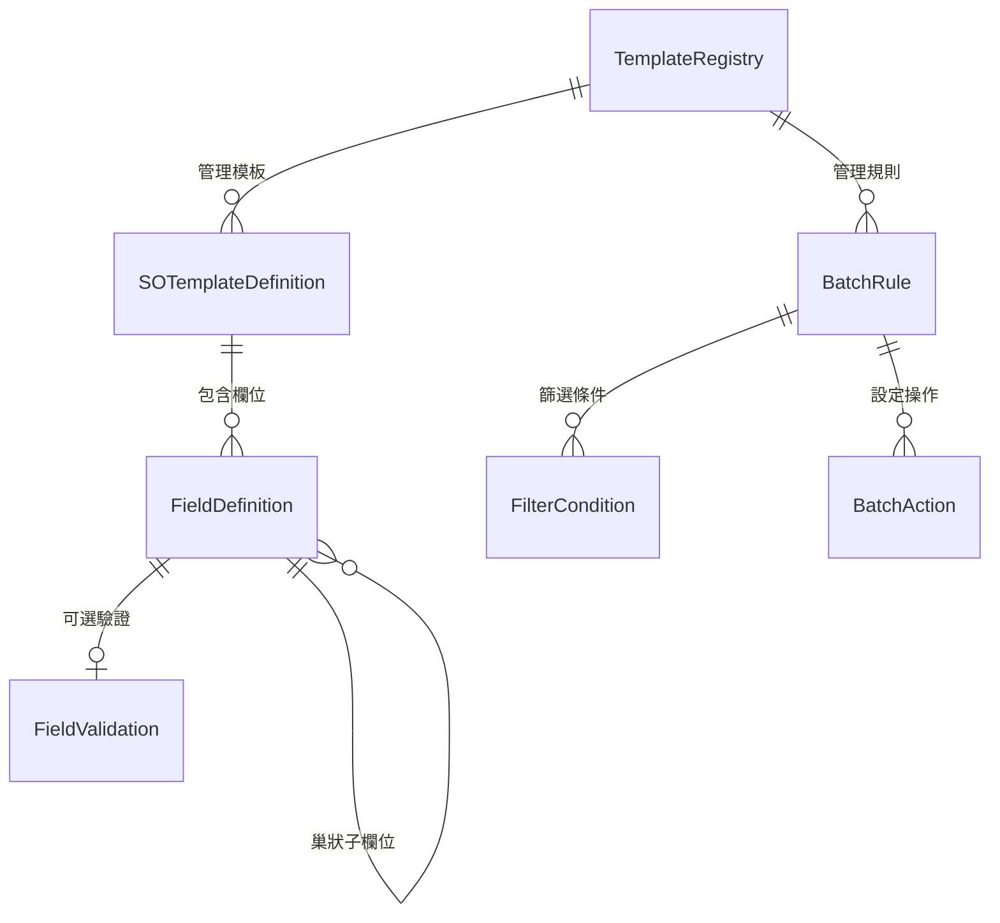
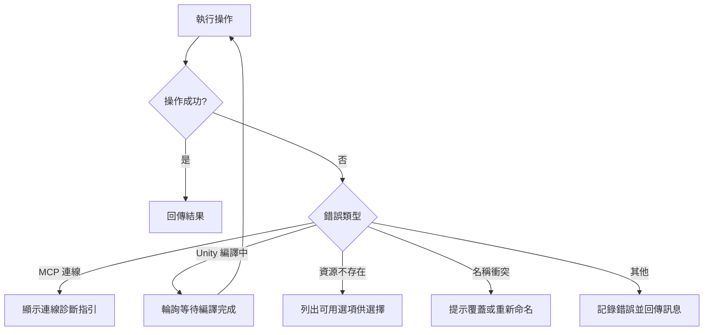

# 設計文件：關卡設計工具鏈 (Level Design Tooling)

## 概述

本設計為 Kiro Unity Power 新增關卡設計工具鏈，提供三大核心功能：

1. **Editor 擴展腳本生成** — 根據目標類別自動生成 Custom Inspector 與 EditorWindow 批次處理工具的 C# 腳本
2. **ScriptableObject 關卡配置模板** — 根據自然語言描述生成結構化的 ScriptableObject 腳本，含驗證規則與自定義 Inspector
3. **場景物件批次設定** — 透過篩選規則自動化設定場景中 GameObject 的 Layer、Tag 與組件參數

所有功能透過現有 MCP 協議與 Unity Editor 通訊，複用 `manage_script`、`create_script`、`manage_gameobject`、`manage_components`、`find_gameobjects`、`manage_editor` 等既有工具。模板與規則以 JSON 格式持久化，遵循現有的自定義優先、內建回退的載入策略。

### 設計決策

| 決策 | 選擇 | 理由 |
|------|------|------|
| 腳本生成方式 | 字串模板拼接 + `create_script` MCP 工具 | 不需引入額外模板引擎，與現有 `create_script` 工具直接整合 |
| 模板持久化格式 | JSON | 與現有 `config-crud.ts` 一致，可直接複用 `loadConfig` / `saveConfig` |
| 批次設定執行方式 | `batch_execute` 包裝多個 MCP 呼叫 | 與現有工作流模式一致，支援原子化操作 |
| 測試框架 | Jest + fast-check | 專案已使用此組合，無需額外依賴 |

## 架構

### 系統架構圖



### 模組職責

| 模組 | 檔案 | 職責 |
|------|------|------|
| `editor-extension-gen` | `src/editor-extension-gen.ts` | 生成 Custom Inspector 與 EditorWindow 批次工具的 C# 腳本 |
| `scriptableobject-template` | `src/scriptableobject-template.ts` | 生成 ScriptableObject 關卡配置腳本與配套 Inspector |
| `scene-batch-config` | `src/scene-batch-config.ts` | 解析批次設定規則、篩選物件、產生 MCP 呼叫序列 |
| `template-registry` | `src/template-registry.ts` | 管理模板與規則的 CRUD 操作，複用 `config-crud.ts` |

### 執行流程




## 元件與介面

### 1. Editor Extension Generator (`editor-extension-gen.ts`)

負責根據目標類別資訊生成 Unity Editor 擴展 C# 腳本。

```typescript
/**
 * 目標類別的序列化欄位資訊
 */
interface SerializedFieldInfo {
  name: string;
  typeName: string;       // e.g. "int", "float", "string", "GameObject", "EnemyType"
  isEnum: boolean;
  isList: boolean;
  listElementType?: string;
}

/**
 * 生成 Custom Inspector 腳本的輸入參數
 */
interface InspectorGenInput {
  targetClassName: string;
  fields: SerializedFieldInfo[];
  namespace?: string;
}

/**
 * 生成 EditorWindow 批次工具腳本的輸入參數
 */
interface BatchToolGenInput {
  toolName: string;
  description: string;
  targetComponentType: string;
  operations: BatchOperation[];
}

interface BatchOperation {
  fieldName: string;
  operationType: 'set' | 'increment' | 'multiply';
  valueExpression: string;
}

/**
 * 腳本生成結果
 */
interface ScriptGenResult {
  fileName: string;
  filePath: string;       // e.g. "Assets/Editor/EnemyConfigInspector.cs"
  content: string;
  scriptType: 'inspector' | 'editorWindow';
}

// 主要函式
function generateInspectorScript(input: InspectorGenInput): ScriptGenResult;
function generateBatchToolScript(input: BatchToolGenInput): ScriptGenResult;
function mapFieldToGuiControl(field: SerializedFieldInfo): string;
```

### 2. ScriptableObject Template Builder (`scriptableobject-template.ts`)

負責根據欄位定義生成 ScriptableObject C# 腳本與配套 Inspector。

```typescript
/**
 * 欄位定義
 */
interface FieldDefinition {
  name: string;
  typeName: string;
  tooltip: string;
  defaultValue?: string;
  validation?: FieldValidation;
  isNested: boolean;
  nestedFields?: FieldDefinition[];
}

interface FieldValidation {
  type: 'range' | 'min' | 'max' | 'custom';
  params: Record<string, number | string>;
}

/**
 * ScriptableObject 模板定義
 */
interface SOTemplateDefinition {
  className: string;
  menuPath: string;
  fileName: string;
  description: string;
  fields: FieldDefinition[];
  createdAt: string;
  updatedAt: string;
  version: number;
}

/**
 * 生成結果（包含 SO 腳本 + Inspector 腳本）
 */
interface SOGenResult {
  soScript: ScriptGenResult;
  inspectorScript: ScriptGenResult;
  nestedClassScripts: ScriptGenResult[];
}

// 主要函式
function generateSOScript(template: SOTemplateDefinition): SOGenResult;
function generateOnValidateMethod(fields: FieldDefinition[]): string;
function serializeTemplate(template: SOTemplateDefinition): string;
function deserializeTemplate(json: string): SOTemplateDefinition;
```

### 3. Scene Batch Configurator (`scene-batch-config.ts`)

負責解析批次設定規則並產生對應的 MCP 呼叫序列。

```typescript
/**
 * 篩選條件
 */
interface FilterCondition {
  type: 'name' | 'tag' | 'layer' | 'component' | 'parentPath';
  value: string;
  useWildcard: boolean;   // 僅 name 類型支援萬用字元
}

/**
 * 批次設定規則
 */
interface BatchRule {
  id: string;
  name: string;
  description: string;
  filters: FilterCondition[];
  actions: BatchAction[];
  createdAt: string;
  updatedAt: string;
  version: number;
}

interface BatchAction {
  type: 'setLayer' | 'setTag' | 'setComponentProperty';
  params: Record<string, string | number | boolean>;
}

/**
 * 批次設定預覽項目
 */
interface PreviewItem {
  gameObjectName: string;
  gameObjectPath: string;
  changes: ChangeDescription[];
}

interface ChangeDescription {
  field: string;
  oldValue: string;
  newValue: string;
}

/**
 * 批次設定執行結果
 */
interface BatchConfigResult {
  totalProcessed: number;
  successCount: number;
  skippedCount: number;
  skippedReasons: SkipReason[];
}

interface SkipReason {
  gameObjectName: string;
  reason: string;
}

// 主要函式
function parseBatchRules(description: string): BatchRule[];
function matchGameObjects(filters: FilterCondition[]): McpToolCall;
function generatePreview(matchedObjects: string[], actions: BatchAction[]): PreviewItem[];
function translateToMcpCalls(matchedObjects: string[], actions: BatchAction[]): McpToolCall[];
function serializeBatchRule(rule: BatchRule): string;
function deserializeBatchRule(json: string): BatchRule;
```

### 4. Template Registry (`template-registry.ts`)

管理模板與規則的持久化，複用現有 `config-crud.ts`。

```typescript
interface TemplateListItem {
  name: string;
  description: string;
  fieldSummary: string;
  createdAt: string;
  updatedAt: string;
  version: number;
}

// 主要函式
function saveTemplate(template: SOTemplateDefinition): void;
function loadTemplate(name: string): SOTemplateDefinition | null;
function listTemplates(): TemplateListItem[];
function deleteTemplate(name: string): boolean;
function saveBatchRule(rule: BatchRule): void;
function loadBatchRule(name: string): BatchRule | null;
function listBatchRules(): TemplateListItem[];
function deleteBatchRule(name: string): boolean;
function checkNameConflict(name: string, type: 'template' | 'batchRule'): boolean;
```


## 資料模型

### SOTemplateDefinition（ScriptableObject 模板定義）

```typescript
interface SOTemplateDefinition {
  className: string;        // e.g. "LevelConfig"
  menuPath: string;         // e.g. "LevelDesign/Level Config"
  fileName: string;         // e.g. "NewLevelConfig"
  description: string;      // 模板用途描述
  fields: FieldDefinition[];
  createdAt: string;        // ISO 8601
  updatedAt: string;        // ISO 8601
  version: number;          // 從 1 開始遞增
}
```

儲存路徑：`Assets/KiroUnityPower/Config/LevelDesign/Templates/{className}.json`

### FieldDefinition（欄位定義）

```typescript
interface FieldDefinition {
  name: string;             // e.g. "maxEnemies"
  typeName: string;         // e.g. "int", "float", "string", "EnemyWave"
  tooltip: string;          // 中文說明，用於 [Tooltip] 屬性
  defaultValue?: string;    // 預設值的字串表示
  validation?: FieldValidation;
  isNested: boolean;        // 是否為巢狀結構
  nestedFields?: FieldDefinition[]; // 巢狀結構的子欄位
}

interface FieldValidation {
  type: 'range' | 'min' | 'max' | 'custom';
  params: Record<string, number | string>;
  // range: { min: number, max: number }
  // min: { value: number }
  // max: { value: number }
  // custom: { expression: string }
}
```

### BatchRule（批次設定規則）

```typescript
interface BatchRule {
  id: string;               // UUID
  name: string;             // e.g. "設定敵人 Layer"
  description: string;
  filters: FilterCondition[];
  actions: BatchAction[];
  createdAt: string;        // ISO 8601
  updatedAt: string;        // ISO 8601
  version: number;
}

interface FilterCondition {
  type: 'name' | 'tag' | 'layer' | 'component' | 'parentPath';
  value: string;            // 篩選值，name 類型支援 * 萬用字元
  useWildcard: boolean;
}

interface BatchAction {
  type: 'setLayer' | 'setTag' | 'setComponentProperty';
  params: Record<string, string | number | boolean>;
  // setLayer: { layer: string }
  // setTag: { tag: string }
  // setComponentProperty: { componentType: string, propertyName: string, value: any }
}
```

儲存路徑：`Assets/KiroUnityPower/Config/LevelDesign/BatchRules/{name}.json`

### ScriptGenResult（腳本生成結果）

```typescript
interface ScriptGenResult {
  fileName: string;         // e.g. "EnemyConfigInspector.cs"
  filePath: string;         // e.g. "Assets/Editor/EnemyConfigInspector.cs"
  content: string;          // 完整的 C# 腳本內容
  scriptType: 'inspector' | 'editorWindow' | 'scriptableObject';
}
```

### 資料關係圖




## 正確性屬性 (Correctness Properties)

*屬性（Property）是指在系統所有有效執行中都應成立的特徵或行為——本質上是對系統應做什麼的形式化陳述。屬性是人類可讀規格與機器可驗證正確性保證之間的橋樑。*

### Property 1: Inspector 腳本結構完整性

*For any* 有效的 `InspectorGenInput`（包含目標類別名稱與序列化欄位列表），生成的 Inspector C# 腳本應同時包含：正確的 `using UnityEditor;` 宣告、`[CustomEditor(typeof(TargetClass))]` 屬性、`OnInspectorGUI` 方法實作，以及 `Undo.RecordObject` 呼叫。

**Validates: Requirements 1.1, 1.3, 1.5**

### Property 2: 批次工具腳本結構完整性

*For any* 有效的 `BatchToolGenInput`（包含工具名稱與操作列表），生成的 EditorWindow C# 腳本應同時包含：`EditorWindow` 繼承、`[MenuItem]` 屬性、`OnGUI` 方法實作，以及 `EditorUtility.DisplayProgressBar` 呼叫。

**Validates: Requirements 1.2, 1.3, 1.7**

### Property 3: 序列化欄位與 GUI 控制項對應

*For any* 序列化欄位列表，生成的 Inspector 腳本中應為每個欄位包含對應的 GUI 控制項呼叫（例如 `EditorGUILayout.IntField`、`EditorGUILayout.FloatField`、`EditorGUILayout.ObjectField`、`EditorGUILayout.EnumPopup`），且控制項數量應等於欄位數量。

**Validates: Requirements 1.4**

### Property 4: 腳本檔案命名慣例

*For any* 目標類別名稱或工具名稱，生成的腳本檔案名稱應遵循 `{TargetClassName}Inspector.cs`（Inspector 類型）或 `{ToolName}Window.cs`（EditorWindow 類型）的命名慣例，且檔案路徑應以 `Assets/Editor/` 開頭。

**Validates: Requirements 1.1, 1.8**

### Property 5: ScriptableObject 腳本結構完整性

*For any* 有效的 `SOTemplateDefinition`（包含類別名稱與欄位定義列表），生成的 ScriptableObject C# 腳本應同時包含：`[CreateAssetMenu]` 屬性、每個欄位的 `[Tooltip]` 屬性（內容與定義中的 tooltip 一致），以及 `OnValidate` 方法。

**Validates: Requirements 2.1, 2.2, 2.4, 2.8**

### Property 6: 欄位型別正確映射

*For any* 欄位定義，生成的 C# 程式碼應正確處理：列表型別欄位使用 `List<T>` 搭配 `[SerializeField]`；帶驗證規則的欄位包含對應的 `[Range]`、`[Min]` 或自定義驗證屬性；巢狀結構欄位生成標記 `[System.Serializable]` 的巢狀類別。

**Validates: Requirements 2.3, 2.5, 2.7**

### Property 7: SO 模板生成配套 Inspector

*For any* 有效的 `SOTemplateDefinition`，生成結果 `SOGenResult` 應同時包含 `soScript`（ScriptableObject 腳本）與 `inspectorScript`（自定義 Inspector 腳本），且 Inspector 腳本的 `[CustomEditor]` 應指向 SO 腳本的類別名稱。

**Validates: Requirements 2.6**

### Property 8: 批次規則動作正確轉譯為 MCP 呼叫

*For any* 批次設定規則（包含任意組合的 `setLayer`、`setTag`、`setComponentProperty` 動作）與匹配的物件列表，`translateToMcpCalls` 產生的 MCP 呼叫序列應為每個物件的每個動作包含正確的工具名稱與參數。

**Validates: Requirements 3.1, 3.2, 3.3**

### Property 9: 篩選條件完整傳遞

*For any* 篩選條件組合（名稱、Tag、Layer、組件類型、父物件路徑），`matchGameObjects` 產生的 `find_gameobjects` MCP 呼叫應包含所有指定的篩選參數，不遺漏任何條件。

**Validates: Requirements 3.4**

### Property 10: 預覽清單完整性

*For any* 匹配的物件列表與動作列表，`generatePreview` 產生的預覽項目數量應等於匹配物件數量，且每個預覽項目的變更描述數量應等於動作數量。

**Validates: Requirements 3.5**

### Property 11: 多規則順序執行

*For any* 批次設定規則列表，產生的 MCP 呼叫序列應按規則在列表中的順序排列，第 i 條規則的所有呼叫應出現在第 i+1 條規則的呼叫之前。

**Validates: Requirements 3.9**

### Property 12: 模板定義 JSON 往返一致性

*For any* 有效的 `SOTemplateDefinition`，執行 `serializeTemplate` 後再執行 `deserializeTemplate` 應產生與原始定義等價的物件。

**Validates: Requirements 4.7**

### Property 13: 批次規則 JSON 往返一致性

*For any* 有效的 `BatchRule`，執行 `serializeBatchRule` 後再執行 `deserializeBatchRule` 應產生與原始規則等價的物件。

**Validates: Requirements 4.1, 4.2, 4.4**

### Property 14: 模板列表完整性與元資料正確性

*For any* 已儲存的模板集合，`listTemplates` 回傳的列表長度應等於已儲存模板數量，且每個項目應包含正確的名稱、描述、建立時間、修改時間與版本號。

**Validates: Requirements 4.3, 4.5**

### Property 15: 範本載入優先順序

*For any* 同時存在於自定義目錄與內建目錄的模板名稱，載入操作應回傳自定義目錄中的版本。

**Validates: Requirements 5.2**

### Property 16: 腳本生成後觸發 Editor 刷新

*For any* 腳本生成操作（Inspector、EditorWindow 或 ScriptableObject），完整的 MCP 呼叫序列最後應包含 `manage_editor(action: "refresh")` 呼叫。

**Validates: Requirements 5.3**


## 錯誤處理

### 錯誤分類與處理策略

| 錯誤類別 | 觸發條件 | 處理方式 |
|----------|----------|----------|
| 類別不存在 | `manage_script(action: "get_info")` 回傳找不到類別 | 回傳錯誤訊息，列出相似名稱的類別供選擇（需求 1.6） |
| Layer/Tag 不存在 | 批次設定指定的 Layer 或 Tag 在專案中未定義 | 回傳錯誤訊息，提供專案中已定義的 Layer 與 Tag 清單（需求 3.8） |
| 模板名稱衝突 | 儲存模板時發現同名模板已存在 | 提示使用者選擇覆蓋或重新命名（需求 4.6） |
| MCP 連線中斷 | MCP Server 未啟動或網路異常 | 顯示連線錯誤訊息，引導使用者確認 Unity Editor 與 MCP Server 狀態（需求 5.5） |
| Unity 正在編譯 | 批次操作期間 Unity Editor 進入編譯狀態 | 等待編譯完成後再繼續執行（需求 5.6） |
| JSON 解析失敗 | 模板或規則 JSON 檔案格式錯誤 | 回傳解析錯誤訊息，回退至內建模板 |
| 腳本生成失敗 | `create_script` MCP 呼叫失敗 | 記錄錯誤，回傳失敗原因（檔案鎖定、路徑不存在等） |

### 錯誤回復流程



## 測試策略

### 測試框架

- **單元測試**：Jest（已在專案中使用）
- **屬性測試**：fast-check（已在專案中使用，版本 ^3.22.0）
- **測試目錄結構**：
  - `tests/unit/` — 單元測試（特定範例、邊界案例、錯誤條件）
  - `tests/property/` — 屬性測試（通用屬性，跨所有輸入驗證）

### 屬性測試配置

- 每個屬性測試最少執行 **100 次迭代**（與現有 `jest.config.ts` 中的 `fast-check.numRuns: 100` 一致）
- 每個屬性測試必須以註解標記對應的設計文件屬性
- 標記格式：`Feature: level-design-tooling, Property {number}: {property_text}`
- 每個正確性屬性由**單一**屬性測試實作

### 單元測試範圍

單元測試聚焦於：
- 特定範例驗證（例如：為已知的 `EnemyConfig` 類別生成 Inspector 腳本，驗證輸出內容）
- 邊界案例（例如：空欄位列表、無驗證規則的模板、不存在的 Layer/Tag）
- 錯誤條件（例如：MCP 連線失敗、JSON 解析錯誤、類別不存在）
- 整合點驗證（例如：`config-crud.ts` 的 `loadConfig`/`saveConfig` 與新模組的整合）

### 屬性測試範圍

屬性測試聚焦於：
- 腳本生成的結構完整性（Property 1-7）
- MCP 呼叫序列的正確性（Property 8-11, 16）
- 序列化往返一致性（Property 12-13）
- 模板管理的資料完整性（Property 14-15）

### fast-check Arbitrary 定義

需要為以下資料型別定義 Arbitrary 生成器：
- `SerializedFieldInfo` — 隨機欄位名稱、型別、是否為列表/列舉
- `InspectorGenInput` — 隨機類別名稱 + 隨機欄位列表
- `BatchToolGenInput` — 隨機工具名稱 + 隨機操作列表
- `FieldDefinition` — 隨機欄位定義（含巢狀結構）
- `SOTemplateDefinition` — 隨機模板定義
- `BatchRule` — 隨機批次規則（含篩選條件與動作）
- `FilterCondition` — 隨機篩選條件
- `BatchAction` — 隨機批次動作

### 測試檔案規劃

| 測試檔案 | 類型 | 涵蓋屬性 |
|----------|------|----------|
| `tests/property/editor-extension-gen.test.ts` | 屬性測試 | Property 1, 2, 3, 4 |
| `tests/property/scriptableobject-template.test.ts` | 屬性測試 | Property 5, 6, 7 |
| `tests/property/scene-batch-config.test.ts` | 屬性測試 | Property 8, 9, 10, 11 |
| `tests/property/template-registry.test.ts` | 屬性測試 | Property 12, 13, 14, 15 |
| `tests/property/mcp-integration.test.ts` | 屬性測試 | Property 16 |
| `tests/unit/editor-extension-gen.test.ts` | 單元測試 | 需求 1.6 邊界案例 |
| `tests/unit/scene-batch-config.test.ts` | 單元測試 | 需求 3.8 邊界案例 |
| `tests/unit/template-registry.test.ts` | 單元測試 | 需求 4.6 邊界案例 |
