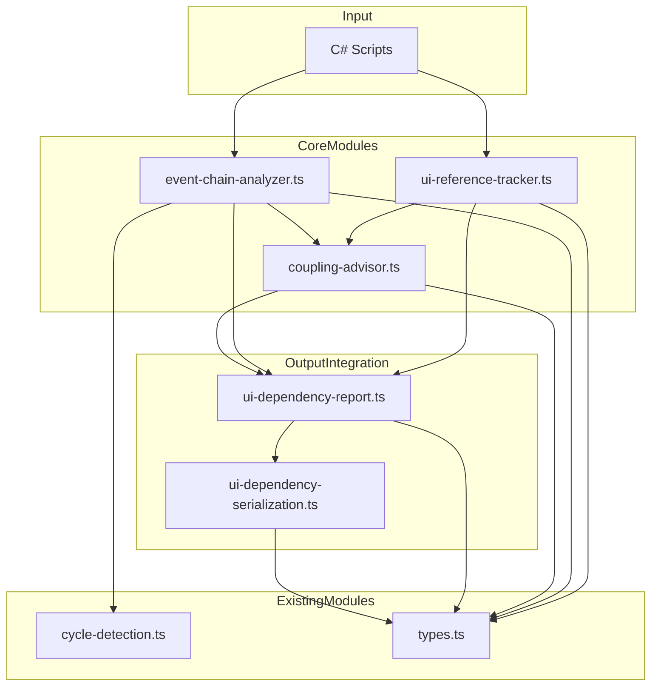

# 設計文件：UI 與遊戲邏輯跨文件依賴分析

## 概述

本設計為 Kiro Unity Power 新增三個核心模組：`UIReferenceTracker`（UI 元件跨文件引用追蹤）、`EventChainAnalyzer`（事件調用鏈分析）與 `CouplingAdvisor`（耦合度評估與重構建議），以及對應的序列化與報告整合功能。

這些模組建立在現有的 `dependency-analysis.ts`（資產依賴分析）、`cycle-detection.ts`（循環依賴偵測）與 `architecture-check.ts`（架構規則檢查）之上。設計遵循現有專案的模組化架構風格：每個模組為獨立的 TypeScript 檔案，透過 `types.ts` 共享型別定義，使用純函式搭配明確的輸入/輸出介面。

### 設計決策

1. **重用 `cycle-detection.ts` 的 `detectCycles`**：事件調用鏈的循環偵測直接複用現有的有向圖循環偵測演算法，避免重複實作。
2. **靜態分析而非執行時分析**：所有分析基於 C# 原始碼的正則表達式匹配與 AST 模式比對，與現有 `code-performance-scanner.ts` 和 `architecture-check.ts` 的做法一致。
3. **純函式設計**：所有公開 API 為純函式，不依賴外部狀態，便於測試與組合。
4. **JSON 序列化格式**：與現有 `profiler-serialization.ts` 的模式一致，提供 serialize/deserialize/formatAsText 三件組。

## 架構



### 資料流

1. 使用者提供 C# 腳本檔案清單
2. `UIReferenceTracker` 掃描所有腳本，建構 UI 元件引用圖
3. `EventChainAnalyzer` 解析事件訂閱與調用鏈，利用 `detectCycles` 偵測循環
4. `CouplingAdvisor` 根據引用圖與調用鏈計算耦合分數，產生重構建議
5. `UIDependencyReport` 整合所有結果為結構化報告
6. `UIDependencySerialization` 提供 JSON 序列化/反序列化與文字格式化

## 元件與介面

### 1. `ui-reference-tracker.ts` — UI 元件引用追蹤

```typescript
/** 掃描所有腳本，回傳指定 UI 元件的引用清單 */
export function trackUIReferences(
  scripts: ScriptFile[],
  targetComponent: UIComponentQuery,
): UIReferenceResult;

/** 建構完整的 UI 元件依賴圖 */
export function buildUIDependencyGraph(
  scripts: ScriptFile[],
): UIDependencyGraph;
```

`ScriptFile` 複用現有 `architecture-check.ts` 中的 `{ path: string; content: string }` 介面。

`UIComponentQuery` 允許依名稱或類型查詢：
```typescript
interface UIComponentQuery {
  name?: string;       // UI 元件名稱（變數名稱）
  typeName?: string;   // UI 類型名稱（如 Button、Toggle）
}
```

引用偵測模式（需求 1.2）：
- `SerializeField` 或 `public` 欄位宣告中的 UI 類型
- `GetComponent<T>()` 或 `GetComponentInChildren<T>()` 呼叫
- `GameObject.Find()` 或 `transform.Find()` 查詢
- `AddComponent<T>()` 動態新增

### 2. `event-chain-analyzer.ts` — 事件調用鏈分析

```typescript
/** 從指定 UI 事件起點追蹤完整調用鏈 */
export function analyzeEventChain(
  scripts: ScriptFile[],
  entryPoint: EventEntryPoint,
  options?: EventChainOptions,
): EventChainResult;
```

事件訂閱偵測模式（需求 2.2）：
- `UnityEvent.AddListener()` 呼叫
- C# event 的 `+=` 訂閱
- `[SerializeField] UnityEvent` 欄位（Inspector 序列化回呼）
- `SendMessage()` 或 `BroadcastMessage()` 呼叫

狀態變更偵測模式（需求 2.4）：
- 靜態欄位寫入（`static` 欄位的賦值）
- `ScriptableObject` 的修改
- `PlayerPrefs.Set*()` 呼叫
- Singleton 模式物件的狀態修改（偵測 `Instance.` 存取後的賦值）

### 3. `coupling-advisor.ts` — 耦合度評估與重構建議

```typescript
/** 計算所有 UI 腳本與遊戲邏輯腳本之間的耦合分數 */
export function calculateCouplingScores(
  referenceResult: UIReferenceResult,
  chainResult: EventChainResult,
): CouplingPair[];

/** 根據耦合分數產生重構建議 */
export function generateRefactoringSuggestions(
  pairs: CouplingPair[],
  threshold?: number,
): RefactoringSuggestion[];
```

耦合分數計算因素（需求 3.2）：
- 直接引用數量（權重 1.0）
- 事件調用鏈深度（權重 0.5 × 深度）
- 共享狀態變更數量（權重 2.0）
- 雙向依賴存在與否（存在則 +10.0 加成）

重構建議類型（需求 3.4）：
- 引入事件匯流排（Event Bus）
- 使用 ScriptableObject 事件通道
- UI 邏輯與遊戲邏輯分層
- 使用介面（Interface）取代具體類型引用

### 4. `ui-dependency-serialization.ts` — 序列化與反序列化

```typescript
/** 將依賴分析報告序列化為 JSON 字串 */
export function serializeUIDependencyReport(report: UIDependencyReport): string;

/** 將 JSON 字串反序列化為依賴分析報告 */
export function deserializeUIDependencyReport(json: string): UIDependencyReport;

/** 將報告格式化為人類可讀的文字 */
export function formatUIDependencyReportAsText(report: UIDependencyReport): string;
```

遵循現有 `profiler-serialization.ts` 的三件組模式。

### 5. `ui-dependency-report.ts` — 報告整合

```typescript
/** 整合所有分析結果為完整報告 */
export function integrateUIDependencyReport(
  referenceResult: UIReferenceResult,
  chainResult: EventChainResult,
  couplingPairs: CouplingPair[],
  suggestions: RefactoringSuggestion[],
): UIDependencyReport;
```

## 資料模型

以下型別將新增至 `types.ts`，遵循現有的命名慣例與結構風格。

```typescript
// ============================================================
// UI Dependency Analysis 型別
// ============================================================

/** UI 元件類型 */
export type UIComponentType =
  | 'Button'
  | 'Toggle'
  | 'Slider'
  | 'InputField'
  | 'Dropdown'
  | 'ScrollRect'
  | 'Text'
  | 'Image';

/** UI 元件引用方式 */
export type ReferenceMethod =
  | 'SerializeField'
  | 'PublicField'
  | 'GetComponent'
  | 'GetComponentInChildren'
  | 'GameObjectFind'
  | 'TransformFind'
  | 'AddComponent';

/** 事件訂閱模式 */
export type EventSubscriptionPattern =
  | 'AddListener'
  | 'CSharpEventSubscription'
  | 'SerializedUnityEvent'
  | 'SendMessage'
  | 'BroadcastMessage';

/** 狀態變更類型 */
export type StateMutationType =
  | 'StaticFieldWrite'
  | 'ScriptableObjectModify'
  | 'PlayerPrefsWrite'
  | 'SingletonStateModify';

/** 事件節點類型 */
export type EventNodeType =
  | 'EventTrigger'
  | 'EventHandler'
  | 'StateMutation';

/** 重構建議類型 */
export type RefactoringSuggestionType =
  | 'EventBus'
  | 'ScriptableObjectChannel'
  | 'LayerSeparation'
  | 'InterfaceDecoupling';

/** UI 元件查詢條件 */
export interface UIComponentQuery {
  name?: string;
  typeName?: string;
}

/** 腳本對 UI 元件的引用 */
export interface ScriptReference {
  filePath: string;
  lineNumber: number;
  referenceMethod: ReferenceMethod;
  componentType: UIComponentType | string;
  /** 引用的變數或欄位名稱 */
  fieldName: string;
}

/** UI 引用追蹤結果 */
export interface UIReferenceResult {
  query: UIComponentQuery;
  references: ScriptReference[];
  /** 高扇入元件（被 3 個以上腳本引用） */
  highFanInComponents: HighFanInComponent[];
  /** 掃描失敗的檔案 */
  failedFiles: FailedFile[];
}

/** 高扇入元件 */
export interface HighFanInComponent {
  componentType: string;
  fieldName: string;
  referenceCount: number;
  referencingScripts: string[];
}

/** UI 依賴圖 */
export interface UIDependencyGraph {
  nodes: UIDependencyNode[];
  edges: UIDependencyEdge[];
}

/** 依賴圖節點 */
export interface UIDependencyNode {
  id: string;
  type: 'script' | 'uiComponent';
  filePath?: string;
  componentType?: string;
}

/** 依賴圖邊 */
export interface UIDependencyEdge {
  source: string;
  target: string;
  referenceMethod: ReferenceMethod;
  lineNumber: number;
}

/** 事件調用鏈入口點 */
export interface EventEntryPoint {
  scriptPath: string;
  componentType: UIComponentType | string;
  eventName: string;
}

/** 事件調用鏈選項 */
export interface EventChainOptions {
  maxDepth?: number;  // 預設 10
}

/** 事件調用鏈中的節點 */
export interface EventNode {
  functionName: string;
  scriptPath: string;
  lineNumber: number;
  nodeType: EventNodeType;
  subscriptionPattern?: EventSubscriptionPattern;
  stateMutationType?: StateMutationType;
}

/** 單一事件調用鏈 */
export interface EventChain {
  entryPoint: EventEntryPoint;
  nodes: EventNode[];
  depth: number;
  /** 是否為過深調用鏈（深度 > 5） */
  isDeepChain: boolean;
  /** 若存在循環，記錄循環路徑 */
  cyclePath?: string[];
}

/** 事件調用鏈分析結果 */
export interface EventChainResult {
  chains: EventChain[];
  /** 過深調用鏈數量 */
  deepChainCount: number;
  /** 偵測到的循環數量 */
  cycleCount: number;
}

/** 耦合配對 */
export interface CouplingPair {
  scriptA: string;
  scriptB: string;
  couplingScore: number;
  directReferenceCount: number;
  maxChainDepth: number;
  sharedStateMutationCount: number;
  isBidirectional: boolean;
}

/** 重構建議 */
export interface RefactoringSuggestion {
  type: RefactoringSuggestionType;
  title: string;
  problemDescription: string;
  steps: string[];
  estimatedImpact: 'high' | 'medium' | 'low';
  targetScripts: string[];
}

/** 完整的 UI 依賴分析報告 */
export interface UIDependencyReport {
  id: string;
  timestamp: string;
  referenceResult: UIReferenceResult;
  chainResult: EventChainResult;
  couplingPairs: CouplingPair[];
  suggestions: RefactoringSuggestion[];
  summary: UIDependencyReportSummary;
}

/** 報告摘要 */
export interface UIDependencyReportSummary {
  totalUIComponents: number;
  totalScriptReferences: number;
  totalEventChains: number;
  deepChainCount: number;
  highCouplingPairCount: number;
}
```


## 正確性屬性（Correctness Properties）

*屬性（Property）是一種在系統所有有效執行中都應成立的特徵或行為——本質上是對系統應做什麼的形式化陳述。屬性是人類可讀規格與機器可驗證正確性保證之間的橋樑。*

### Property 1: UI 引用偵測涵蓋所有引用模式

*For any* C# 腳本包含已知的 UI 引用模式（SerializeField 欄位、public 欄位、GetComponent 呼叫、GetComponentInChildren 呼叫、GameObject.Find 查詢、transform.Find 查詢、AddComponent 呼叫），`trackUIReferences` 應偵測到該引用，且回傳的 `ScriptReference` 中的 `referenceMethod` 應正確對應該模式。

**Validates: Requirements 1.1, 1.2**

### Property 2: 依賴圖邊數等於引用數

*For any* 一組 C# 腳本，`buildUIDependencyGraph` 產生的 `UIDependencyGraph` 中的邊數應等於所有偵測到的 `ScriptReference` 數量，且每條邊的 source/target 應對應一筆實際的引用關係。

**Validates: Requirements 1.3**

### Property 3: 高扇入元件閾值判定

*For any* UI 元件，若引用該元件的腳本數量大於 3，則該元件應出現在 `highFanInComponents` 清單中且 `referenceCount` 正確；若引用數量小於或等於 3，則不應出現在該清單中。

**Validates: Requirements 1.4**

### Property 4: 掃描失敗不影響其餘結果

*For any* 一組腳本中混合有效與無效（無法讀取）的腳本，`trackUIReferences` 應回傳所有有效腳本的引用結果，且 `failedFiles` 清單應包含所有無效腳本的路徑與錯誤訊息。

**Validates: Requirements 1.5**

### Property 5: 事件調用鏈涵蓋所有訂閱模式

*For any* C# 腳本包含已知的事件訂閱模式（AddListener、+= 訂閱、SerializedUnityEvent、SendMessage、BroadcastMessage），`analyzeEventChain` 應將該訂閱者納入事件調用鏈中，且對應的 `EventNode` 應記錄正確的 `subscriptionPattern`。

**Validates: Requirements 2.1, 2.2**

### Property 6: 事件節點元資料完整性

*For any* `EventChain` 中的 `EventNode`，其 `functionName` 應為非空字串、`scriptPath` 應為非空字串、`lineNumber` 應為正整數、`nodeType` 應為有效的 `EventNodeType` 值。

**Validates: Requirements 2.3**

### Property 7: 狀態變更偵測

*For any* C# 腳本包含已知的狀態變更模式（靜態欄位寫入、ScriptableObject 修改、PlayerPrefs 寫入、Singleton 狀態修改），事件調用鏈末端的 `EventNode` 應標記為 `StateMutation` 類型，且 `stateMutationType` 應正確對應該模式。

**Validates: Requirements 2.4**

### Property 8: 過深調用鏈閾值判定

*For any* `EventChain`，`isDeepChain` 應為 `true` 若且唯若 `depth > 5`。

**Validates: Requirements 2.5**

### Property 9: 循環偵測與中止

*For any* 一組腳本中存在事件調用循環（A 觸發 B，B 又觸發 A），`analyzeEventChain` 應偵測到該循環，在對應的 `EventChain` 中設定 `cyclePath`，且不會因無限遞迴而掛起。

**Validates: Requirements 2.6**

### Property 10: 耦合分數計算確定性

*For any* 一組 `UIReferenceResult` 與 `EventChainResult`，`calculateCouplingScores` 產生的 `CouplingScore` 應為其四個因素（直接引用數量、事件調用鏈深度、共享狀態變更數量、雙向依賴存在與否）的確定性函式。相同輸入應產生相同分數。

**Validates: Requirements 3.1, 3.2**

### Property 11: 重構建議閾值與類型

*For any* `CouplingPair`，若其 `couplingScore` 超過設定閾值，`generateRefactoringSuggestions` 應產生至少一個 `RefactoringSuggestion`，且其 `type` 應為四種有效類型之一（EventBus、ScriptableObjectChannel、LayerSeparation、InterfaceDecoupling）。若分數未超過閾值，則不應產生建議。

**Validates: Requirements 3.3, 3.4**

### Property 12: 雙向依賴提升耦合分數

*For any* 兩個腳本之間的依賴關係，若存在雙向依賴（A 引用 B 且 B 引用 A），其 `couplingScore` 應嚴格大於僅有單向依賴（其餘因素相同）時的分數。

**Validates: Requirements 3.5**

### Property 13: 報告摘要與明細一致性

*For any* `UIDependencyReport`，其 `summary` 中的 `totalScriptReferences` 應等於 `referenceResult.references.length`，`totalEventChains` 應等於 `chainResult.chains.length`，`deepChainCount` 應等於 `chainResult.deepChainCount`。

**Validates: Requirements 4.1, 4.2**

### Property 14: 耦合配對依分數降序排列

*For any* `UIDependencyReport` 中的 `couplingPairs` 陣列，對於所有相鄰元素 `pairs[i]` 與 `pairs[i+1]`，應滿足 `pairs[i].couplingScore >= pairs[i+1].couplingScore`。

**Validates: Requirements 4.3**

### Property 15: 序列化往返屬性

*For any* 有效的 `UIDependencyReport` 物件，`deserializeUIDependencyReport(serializeUIDependencyReport(report))` 應產生與原始 `report` 深度相等的物件。

**Validates: Requirements 5.1, 5.2, 5.4**

### Property 16: 格式化文字包含關鍵資訊

*For any* `UIDependencyReport`，`formatUIDependencyReportAsText` 產生的文字應包含報告中所有 `ScriptReference` 的 `filePath`、所有 `CouplingPair` 的 `scriptA` 與 `scriptB`、以及所有 `RefactoringSuggestion` 的 `title`。

**Validates: Requirements 5.3**

## 錯誤處理

### 腳本讀取失敗

- `UIReferenceTracker` 與 `EventChainAnalyzer` 在處理單一腳本時若發生例外，應捕獲該例外並記錄至 `failedFiles` 清單，繼續處理其餘腳本。
- `failedFiles` 中每筆記錄包含 `filePath` 與 `error` 字串。

### 無效 JSON 反序列化

- `deserializeUIDependencyReport` 在接收到無效 JSON 字串時，應拋出包含描述性訊息的 `Error`。
- 在接收到結構不符合 `UIDependencyReport` 的 JSON 時，應拋出包含缺失欄位名稱的 `Error`。
- 遵循現有 `profiler-serialization.ts` 中 `deserializeReport` 的驗證模式。

### 事件調用鏈循環

- `EventChainAnalyzer` 在偵測到循環時，應中止該路徑的遞迴追蹤，在 `EventChain` 中設定 `cyclePath`，並繼續分析其他路徑。
- 使用現有 `cycle-detection.ts` 的 `detectCycles` 函式進行循環偵測。

### 空輸入

- 所有公開函式在接收空陣列輸入時，應回傳有效的空結果物件（空清單、零計數），而非拋出例外。

## 測試策略

### 測試框架

- 單元測試：Jest（`tests/unit/`）
- 屬性測試：fast-check + Jest（`tests/property/`）
- 遵循現有專案的測試目錄結構與命名慣例

### 單元測試

單元測試聚焦於具體範例、邊界情況與錯誤條件：

- **ui-reference-tracker**：測試各種 C# 引用模式的偵測（SerializeField、GetComponent 等）、高扇入元件標記、掃描失敗處理
- **event-chain-analyzer**：測試各種事件訂閱模式的偵測、狀態變更識別、過深調用鏈標記、循環偵測與中止
- **coupling-advisor**：測試耦合分數計算公式、閾值判定、雙向依賴加成、各類重構建議產生
- **ui-dependency-report**：測試報告整合、摘要計數一致性、排序正確性
- **ui-dependency-serialization**：測試無效 JSON 處理、結構驗證錯誤訊息

### 屬性測試

每個正確性屬性對應一個屬性測試，使用 fast-check 產生隨機輸入，每個測試至少執行 100 次迭代。

每個屬性測試必須以註解標記對應的設計屬性：
- 格式：`// Feature: ui-dependency-analysis, Property {number}: {property_text}`

屬性測試檔案：`tests/property/ui-dependency-properties.test.ts`

關鍵的 fast-check arbitrary 生成器：
- `scriptFileArb`：產生包含隨機 UI 引用模式的 C# 腳本
- `eventChainScriptsArb`：產生包含已知事件訂閱關係的腳本組
- `couplingPairArb`：產生隨機的耦合配對資料
- `uiDependencyReportArb`：產生完整的依賴分析報告（用於序列化往返測試）

### 測試覆蓋重點

- 單元測試：具體的 C# 程式碼片段偵測、邊界值（恰好 3 個引用 vs 4 個引用）、錯誤輸入
- 屬性測試：跨所有有效輸入的通用屬性驗證、序列化往返、排序不變量、閾值判定
- 兩者互補：單元測試捕捉具體 bug，屬性測試驗證通用正確性
