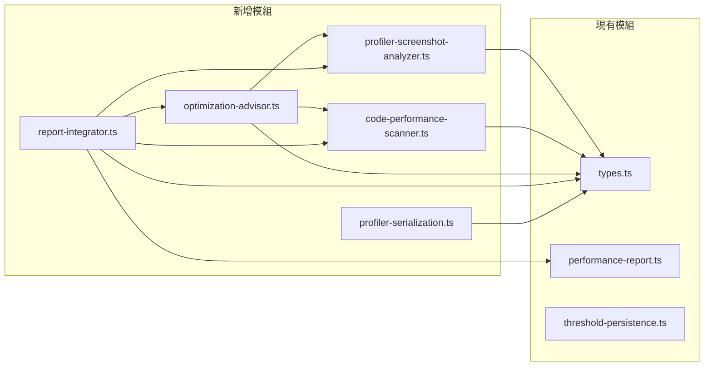

# 設計文件：Unity 效能分析器（Performance Profiler）

## 概述

本設計文件描述 Unity 效能分析器的技術架構與實作方案。此功能擴展現有的 `performance-report.ts` 與 `memory-budget.ts` 模組，新增三個核心模組：

1. **ProfilerScreenshotAnalyzer** — 解析 Unity Profiler 截圖，提取 CPU/GPU/記憶體指標並識別熱點
2. **CodePerformanceScanner** — 掃描 C# 程式碼中的效能反模式（GetComponent 濫用、GC 分配、Draw Call 問題等）
3. **OptimizationAdvisor** — 根據分析結果產生具體最佳化方案

這三個模組的輸出最終整合為結構化的效能報告，與現有 `PerformanceReport` 型別相容，並支援 JSON 序列化/反序列化的往返屬性。

### 設計決策

- **模組化架構**：每個分析器為獨立模組，可單獨使用或組合使用，遵循現有專案的單一檔案模組模式
- **與現有型別整合**：擴展 `types.ts` 中的 `SeverityLevel`、`PerformanceReport`、`Bottleneck` 等既有型別，避免重複定義
- **MCP 工具整合**：透過現有的 MCP 工具介面讀取 Unity 專案檔案，不直接存取檔案系統
- **純函式設計**：核心分析邏輯為純函式，方便測試與組合

## 架構

```mermaid
graph TD
    A[使用者輸入] --> B{輸入類型}
    B -->|Profiler 截圖| C[ProfilerScreenshotAnalyzer]
    B -->|C# 程式碼| D[CodePerformanceScanner]
    
    C --> E[ScreenshotAnalysisResult]
    D --> F[CodeScanResult]
    
    E --> G[OptimizationAdvisor]
    F --> G
    
    G --> H[OptimizationPlan[]]
    
    E --> I[ReportIntegrator]
    F --> I
    H --> I
    
    I --> J[ProfilerReport]
    
    J --> K[serializeReport / deserializeReport]
    J --> L[formatReportAsText]
```

### 模組依賴關係



## 元件與介面

### 1. ProfilerScreenshotAnalyzer（`profiler-screenshot-analyzer.ts`）

負責解析 Profiler 截圖描述資料，提取效能指標並識別熱點。

```typescript
/**
 * 解析 Profiler 截圖資料，回傳結構化的分析結果。
 * 輸入為截圖的描述性資料（由 MCP 視覺工具提取的文字描述）。
 */
export function analyzeScreenshot(
  input: ScreenshotInput,
  thresholds: PerformanceThresholds,
): ScreenshotAnalysisResult;

/**
 * 從截圖資料中提取函式執行時間並排序。
 */
export function extractFunctionTimings(
  cpuData: CpuTimelineEntry[],
): FunctionTiming[];

/**
 * 識別超過閾值的熱點。
 */
export function identifyHotspots(
  metrics: ProfilerMetrics,
  thresholds: PerformanceThresholds,
): Hotspot[];

/**
 * 批次分析多張截圖並合併結果。
 */
export function analyzeBatch(
  inputs: ScreenshotInput[],
  thresholds: PerformanceThresholds,
): ScreenshotAnalysisResult;
```

### 2. CodePerformanceScanner（`code-performance-scanner.ts`）

掃描 C# 程式碼中的效能反模式。

```typescript
/**
 * 掃描單一 C# 腳本內容，回傳偵測到的反模式清單。
 */
export function scanScript(
  filePath: string,
  content: string,
): AntipatternMatch[];

/**
 * 掃描多個腳本，回傳完整的掃描結果（含失敗記錄）。
 */
export function scanAllScripts(
  scripts: ScriptFile[],
): CodeScanResult;

/**
 * 檢查單行程式碼是否匹配特定反模式。
 */
export function matchAntipattern(
  line: string,
  lineNumber: number,
  context: ScanContext,
): AntipatternMatch | null;
```

### 3. OptimizationAdvisor（`optimization-advisor.ts`）

根據分析結果產生最佳化建議。

```typescript
/**
 * 針對熱點清單產生最佳化方案。
 */
export function generateOptimizations(
  hotspots: Hotspot[],
): OptimizationPlan[];

/**
 * 針對反模式清單產生最佳化方案。
 */
export function generateAntipatternFixes(
  antipatterns: AntipatternMatch[],
): OptimizationPlan[];

/**
 * 為最佳化方案標註預估影響程度與實作難度。
 */
export function assessOptimization(
  plan: OptimizationPlan,
): AssessedOptimizationPlan;
```

### 4. ReportIntegrator（`report-integrator.ts`）

整合所有分析結果為統一報告。

```typescript
/**
 * 整合截圖分析、程式碼掃描與最佳化建議為完整報告。
 */
export function integrateReport(
  screenshotResult: ScreenshotAnalysisResult | null,
  codeScanResult: CodeScanResult | null,
  optimizations: OptimizationPlan[],
): ProfilerReport;

/**
 * 產生報告摘要。
 */
export function generateSummary(
  report: ProfilerReport,
): ReportSummary;
```

### 5. ProfilerSerialization（`profiler-serialization.ts`）

序列化與反序列化效能分析結果。

```typescript
/**
 * 將 ProfilerReport 序列化為 JSON 字串。
 */
export function serializeReport(report: ProfilerReport): string;

/**
 * 將 JSON 字串反序列化為 ProfilerReport。
 * 若 JSON 格式無效則拋出錯誤。
 */
export function deserializeReport(json: string): ProfilerReport;

/**
 * 將 ProfilerReport 格式化為人類可讀的文字報告。
 */
export function formatReportAsText(report: ProfilerReport): string;
```

## 資料模型

以下型別將新增至 `types.ts` 或在各模組中定義：

```typescript
// ============================================================
// Profiler Screenshot Analyzer 型別
// ============================================================

/** Profiler 截圖的輸入資料 */
export interface ScreenshotInput {
  /** 截圖的描述性資料（MCP 視覺工具提取的文字） */
  description: string;
  /** CPU 時間軸資料（若可提取） */
  cpuTimeline?: CpuTimelineEntry[];
  /** 記憶體分配資料（若可提取） */
  memoryAllocations?: MemoryAllocationEntry[];
  /** GPU 使用率資料（若可提取） */
  gpuUsage?: number;
}

/** CPU 時間軸中的單一函式條目 */
export interface CpuTimelineEntry {
  functionName: string;
  /** 執行時間（毫秒） */
  timeMs: number;
  /** 佔總 CPU 時間的百分比 */
  percentage: number;
}

/** 記憶體分配條目 */
export interface MemoryAllocationEntry {
  source: string;
  /** 分配量（位元組） */
  sizeBytes: number;
  /** 是否為 GC 分配 */
  isGcAllocation: boolean;
}

/** Profiler 指標 */
export interface ProfilerMetrics {
  cpuUsagePercent: number;
  gpuUsagePercent: number;
  memoryUsageMB: number;
  gcAllocationBytes: number;
  drawCalls: number;
  frameTimeMs: number;
}

/** 效能熱點 */
export interface Hotspot {
  /** 熱點類別：cpu、gpu、memory */
  category: 'cpu' | 'gpu' | 'memory';
  /** 描述 */
  description: string;
  /** 相關數值 */
  value: number;
  /** 嚴重程度 */
  severity: SeverityLevel;
  /** 來源（函式名稱或物件路徑） */
  source: string;
}

/** 函式執行時間排序結果 */
export interface FunctionTiming {
  functionName: string;
  timeMs: number;
  percentage: number;
}

/** 截圖分析結果 */
export interface ScreenshotAnalysisResult {
  metrics: ProfilerMetrics;
  hotspots: Hotspot[];
  functionTimings: FunctionTiming[];
  memoryAllocations: MemoryAllocationEntry[];
  /** 分析是否成功 */
  success: boolean;
  /** 錯誤訊息（若分析失敗） */
  error?: string;
}

// ============================================================
// Code Performance Scanner 型別
// ============================================================

/** 反模式類型 */
export type AntipatternType =
  | 'GetComponentInUpdate'
  | 'StringConcatInUpdate'
  | 'LinqInUpdate'
  | 'NewAllocationInUpdate'
  | 'FindInUpdate'
  | 'NoStaticBatching'
  | 'NoGpuInstancing'
  | 'TooManyMaterials'
  | 'FrequentArrayAllocation'
  | 'ForeachNonGeneric'
  | 'ClosureAllocation';

/** 反模式匹配結果 */
export interface AntipatternMatch {
  filePath: string;
  lineNumber: number;
  antipatternType: AntipatternType;
  severity: SeverityLevel;
  /** 匹配到的程式碼片段 */
  codeSnippet: string;
  /** 問題描述 */
  description: string;
}

/** 掃描用的上下文（追蹤是否在 Update 類方法內） */
export interface ScanContext {
  /** 目前是否在 Update/FixedUpdate/LateUpdate 方法內 */
  inUpdateMethod: boolean;
  /** 目前方法名稱 */
  currentMethod: string;
  /** 大括號深度 */
  braceDepth: number;
}

/** 腳本檔案 */
export interface ScriptFile {
  filePath: string;
  content: string;
}

/** 程式碼掃描結果 */
export interface CodeScanResult {
  antipatterns: AntipatternMatch[];
  /** 掃描失敗的檔案清單 */
  failedFiles: FailedFile[];
  /** 成功掃描的檔案數 */
  scannedCount: number;
}

/** 掃描失敗的檔案 */
export interface FailedFile {
  filePath: string;
  error: string;
}

// ============================================================
// Optimization Advisor 型別
// ============================================================

/** 最佳化方案 */
export interface OptimizationPlan {
  /** 方案標題 */
  title: string;
  /** 詳細描述 */
  description: string;
  /** 對應的熱點類型或反模式類型 */
  targetType: string;
  /** 具體步驟 */
  steps: string[];
  /** 預估影響程度 */
  estimatedImpact: 'high' | 'medium' | 'low';
  /** 實作難度 */
  implementationDifficulty: 'high' | 'medium' | 'low';
}

// ============================================================
// Report Integrator 型別
// ============================================================

/** 完整的效能分析報告 */
export interface ProfilerReport {
  id: string;
  timestamp: string;
  /** 截圖分析結果 */
  screenshotAnalysis: ScreenshotAnalysisResult | null;
  /** 程式碼掃描結果 */
  codeScanResult: CodeScanResult | null;
  /** 最佳化方案 */
  optimizations: OptimizationPlan[];
  /** 報告摘要 */
  summary: ReportSummary;
}

/** 報告摘要 */
export interface ReportSummary {
  /** 熱點總數 */
  totalHotspots: number;
  /** 各嚴重程度的問題數量 */
  severityCounts: Record<SeverityLevel, number>;
  /** 最優先處理的前三項問題 */
  topIssues: TopIssue[];
}

/** 優先問題 */
export interface TopIssue {
  description: string;
  severity: SeverityLevel;
  source: string;
}
```

### 與現有型別的關係

| 新增型別 | 關聯的現有型別 | 關係 |
|---------|-------------|------|
| `Hotspot` | `Bottleneck` | 擴展概念，增加 category 與 source |
| `ProfilerReport` | `PerformanceReport` | 更完整的報告格式，包含多種分析來源 |
| `AntipatternMatch.severity` | `SeverityLevel` | 直接使用現有列舉 |
| `OptimizationPlan` | `Bottleneck.suggestion` | 從字串建議擴展為結構化方案 |

## 正確性屬性（Correctness Properties）

*屬性（Property）是指在系統所有有效執行中都應成立的特徵或行為——本質上是對系統應做之事的形式化陳述。屬性作為人類可讀規格與機器可驗證正確性保證之間的橋樑。*

### Property 1：截圖分析產生結構化指標

*For any* 有效的 `ScreenshotInput`，`analyzeScreenshot` 應回傳包含 `cpuUsagePercent`、`gpuUsagePercent`、`memoryUsageMB` 的 `ProfilerMetrics`，且所有數值皆為非負數。

**Validates: Requirements 1.1**

### Property 2：熱點識別遵循閾值規則

*For any* `ProfilerMetrics` 與 `PerformanceThresholds`，`identifyHotspots` 回傳的每個 `Hotspot` 的對應指標值都應超過該指標的閾值，且每個 `Hotspot` 的 `category` 必須為 `'cpu'`、`'gpu'` 或 `'memory'` 之一。

**Validates: Requirements 1.2**

### Property 3：函式執行時間依耗時降序排列

*For any* `CpuTimelineEntry[]` 清單，`extractFunctionTimings` 回傳的 `FunctionTiming[]` 應依 `timeMs` 由高到低排序，即對於所有相鄰元素 `result[i].timeMs >= result[i+1].timeMs`。

**Validates: Requirements 1.3**

### Property 4：GC 分配正確提取

*For any* `MemoryAllocationEntry[]` 清單，分析結果中的 GC 分配總量應等於所有 `isGcAllocation === true` 條目的 `sizeBytes` 總和，且每個 GC 分配條目的 `source` 應保留原始值。

**Validates: Requirements 1.4**

### Property 5：反模式偵測涵蓋所有已知模式

*For any* 包含已知效能反模式（GetComponent、字串串接、LINQ、new 分配、Find）的 C# 程式碼片段，若該模式出現在 Update/FixedUpdate/LateUpdate 方法內，`scanScript` 應偵測到至少一個對應的 `AntipatternMatch`。

**Validates: Requirements 2.2, 2.3, 2.4**

### Property 6：偵測到的反模式包含完整中繼資料

*For any* `scanScript` 回傳的 `AntipatternMatch`，其 `filePath` 應為非空字串、`lineNumber` 應為正整數、`antipatternType` 應為有效的 `AntipatternType` 值、`severity` 應為有效的 `SeverityLevel` 值。

**Validates: Requirements 2.5**

### Property 7：最佳化器為每個問題產生至少一個方案

*For any* 非空的 `Hotspot[]` 或 `AntipatternMatch[]`，`generateOptimizations` 或 `generateAntipatternFixes` 回傳的 `OptimizationPlan[]` 長度應大於等於輸入清單長度。

**Validates: Requirements 3.1**

### Property 8：最佳化建議與問題類別相符

*For any* `Hotspot`，`generateOptimizations` 產生的 `OptimizationPlan` 的 `targetType` 應與該 `Hotspot` 的 `category` 相關，且方案內容應包含該類別的已知最佳化策略關鍵字（如 Draw Call 類別應包含 Batching/Instancing/LOD/Culling，GC 類別應包含 Object Pool/Cache/StringBuilder）。

**Validates: Requirements 3.2, 3.3, 3.4, 3.5**

### Property 9：所有最佳化方案標註影響程度與難度

*For any* `OptimizationPlan`，其 `estimatedImpact` 應為 `'high'`、`'medium'` 或 `'low'` 之一，且 `implementationDifficulty` 應為 `'high'`、`'medium'` 或 `'low'` 之一。

**Validates: Requirements 3.6**

### Property 10：報告整合所有分析來源

*For any* 非空的 `ScreenshotAnalysisResult` 與 `CodeScanResult`，`integrateReport` 產生的 `ProfilerReport` 應包含來自兩者的所有熱點與反模式資料，不遺漏任何項目。

**Validates: Requirements 4.1**

### Property 11：報告問題依嚴重程度排序

*For any* `ProfilerReport`，報告中的所有問題（熱點與反模式）應依 `Severity` 由高到低排序（Error > Warning > Suggestion）。

**Validates: Requirements 4.2**

### Property 12：報告摘要計數與實際資料一致

*For any* `ProfilerReport`，其 `summary.totalHotspots` 應等於報告中實際的熱點數量，`summary.severityCounts` 中各等級的數量應與實際問題數量一致，且 `summary.topIssues` 長度應不超過 3。

**Validates: Requirements 4.3**

### Property 13：批次分析合併所有截圖結果

*For any* `ScreenshotInput[]` 清單，`analyzeBatch` 回傳的結果中的熱點集合應為各個別分析結果熱點集合的聯集。

**Validates: Requirements 4.4**

### Property 14：序列化往返屬性

*For any* 有效的 `ProfilerReport` 物件，`deserializeReport(serializeReport(report))` 應產生與原始 `report` 深度相等的物件。

**Validates: Requirements 5.4**

### Property 15：格式化文字包含關鍵報告資訊

*For any* `ProfilerReport`，`formatReportAsText` 的輸出字串應包含所有熱點的描述、嚴重程度文字、以及所有最佳化方案的標題。

**Validates: Requirements 5.3**

## 錯誤處理

### 截圖分析錯誤

| 錯誤情境 | 處理方式 |
|---------|---------|
| 截圖輸入資料為空或缺少必要欄位 | 回傳 `ScreenshotAnalysisResult` 且 `success: false`，`error` 欄位描述缺少的資料 |
| 截圖描述無法解析為有效指標 | 回傳 `success: false`，建議使用者重新截圖並確保 Profiler 視窗完整可見 |
| CPU 時間軸資料格式異常 | 跳過異常條目，僅處理有效條目，在結果中記錄警告 |

### 程式碼掃描錯誤

| 錯誤情境 | 處理方式 |
|---------|---------|
| 單一腳本讀取失敗 | 記錄至 `CodeScanResult.failedFiles`，繼續掃描其餘腳本 |
| 腳本內容為空 | 視為無反模式，正常回傳空結果 |
| 腳本編碼格式異常 | 記錄至 `failedFiles`，繼續處理其餘檔案 |

### 最佳化建議錯誤

| 錯誤情境 | 處理方式 |
|---------|---------|
| 未知的熱點類別 | 產生通用最佳化建議，標註為 `Suggestion` 等級 |
| 輸入清單為空 | 回傳空的 `OptimizationPlan[]` |

### 序列化錯誤

| 錯誤情境 | 處理方式 |
|---------|---------|
| JSON 格式無效 | `deserializeReport` 拋出描述性錯誤，包含解析失敗的位置資訊 |
| JSON 結構不符合 `ProfilerReport` 型別 | 拋出驗證錯誤，列出缺少或型別不符的欄位 |

## 測試策略

### 雙軌測試方法

本功能採用單元測試與屬性測試並行的策略：

- **單元測試**：驗證特定範例、邊界案例與錯誤條件
- **屬性測試**：驗證跨所有輸入的通用屬性

兩者互補，單元測試捕捉具體錯誤，屬性測試驗證一般性正確性。

### 屬性測試配置

- **測試框架**：Jest + fast-check（專案已安裝 `fast-check ^3.22.0`）
- **每個屬性測試最少執行 100 次迭代**
- **每個屬性測試必須以註解標記對應的設計屬性**
- **標記格式**：`Feature: unity-performance-profiler, Property {number}: {property_text}`

### 測試檔案結構

```
tests/
├── unit/
│   ├── profiler-screenshot-analyzer.test.ts
│   ├── code-performance-scanner.test.ts
│   ├── optimization-advisor.test.ts
│   └── report-integrator.test.ts
├── property/
│   ├── profiler-analysis-properties.test.ts
│   ├── code-scanner-properties.test.ts
│   ├── optimization-properties.test.ts
│   ├── report-properties.test.ts
│   └── serialization-properties.test.ts
```

### 單元測試重點

- 截圖分析：空輸入、缺少欄位、單一熱點識別的具體範例
- 程式碼掃描：各反模式的具體 C# 程式碼範例、掃描失敗的容錯處理
- 最佳化建議：各類別熱點的具體建議內容驗證
- 報告整合：僅截圖、僅程式碼掃描、兩者皆有的整合範例
- 序列化：無效 JSON 的錯誤處理、空報告的邊界案例

### 屬性測試對應

| 屬性 | 測試檔案 | 說明 |
|-----|---------|------|
| Property 1-4 | `profiler-analysis-properties.test.ts` | 截圖分析相關屬性 |
| Property 5-6 | `code-scanner-properties.test.ts` | 程式碼掃描相關屬性 |
| Property 7-9 | `optimization-properties.test.ts` | 最佳化建議相關屬性 |
| Property 10-13 | `report-properties.test.ts` | 報告整合相關屬性 |
| Property 14-15 | `serialization-properties.test.ts` | 序列化相關屬性 |

### fast-check 生成器設計

需要為以下型別建立 `Arbitrary` 生成器：

- `ScreenshotInput`：隨機生成 CPU/GPU/記憶體指標資料
- `CpuTimelineEntry[]`：隨機函式名稱與執行時間
- `MemoryAllocationEntry[]`：隨機記憶體分配條目
- `ProfilerMetrics`：隨機效能指標
- `PerformanceThresholds`：隨機閾值配置
- `AntipatternMatch`：隨機反模式匹配結果
- `Hotspot`：隨機熱點資料
- `OptimizationPlan`：隨機最佳化方案
- `ProfilerReport`：隨機完整報告（用於序列化往返測試）

每個屬性測試必須由單一 property-based test 實作，確保每個正確性屬性有明確的測試對應。