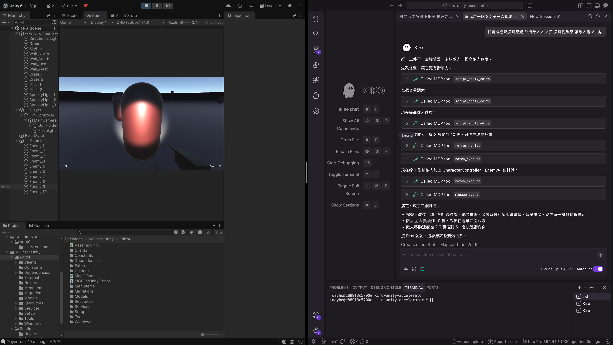
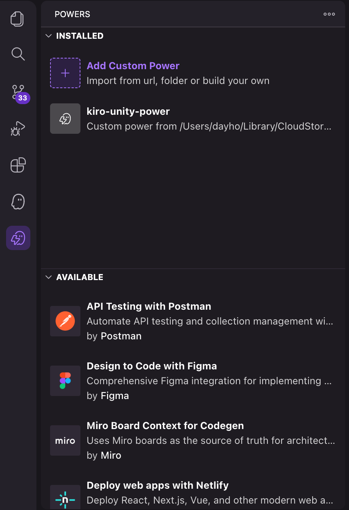
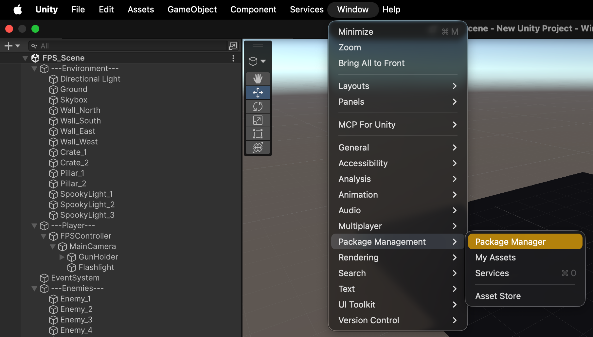
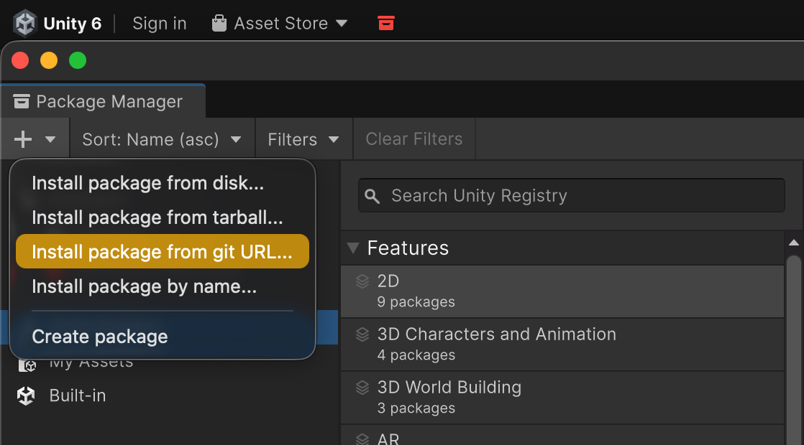
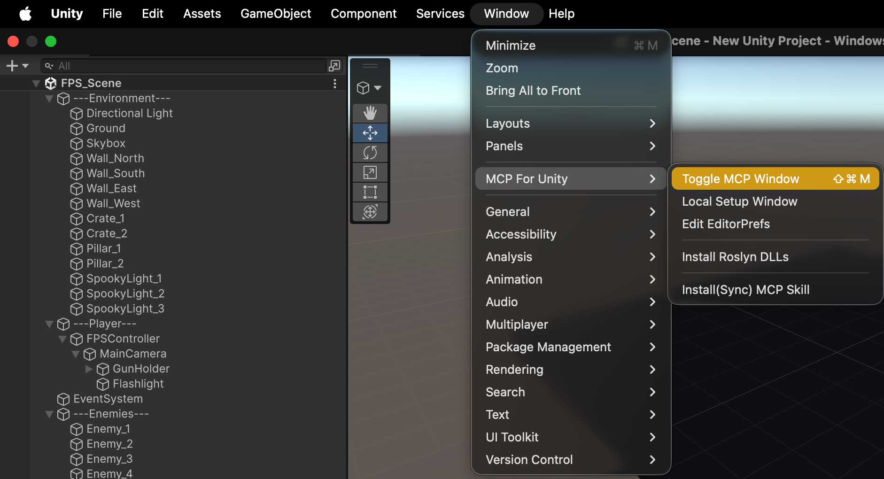
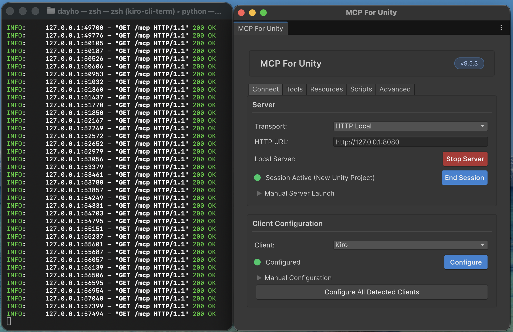

# Kiro Unity Power

讓 Kiro 成為你的 Unity 開發智慧大腦。透過自然語言下達指令，Kiro 經由 MCP（Model Context Protocol）遠端操控 Unity Editor，涵蓋資產管理、場景建置、建置自動化、效能分析、程式碼品質檢查等十一大核心功能，搭配 40+ 個 TypeScript 工具模組與 14 份領域知識文件，讓你用一句話完成過去需要數十次手動操作的工作。



### 🎬 製作過程影片

[](https://youtu.be/102XLONSscM)

👉 [觀看完整製作過程](https://youtu.be/102XLONSscM)

---

## 安裝設定

### 前置需求

- [Unity Editor](https://unity.com/) 已安裝並開啟專案
- [Kiro IDE](https://kiro.dev/docs/getting-started/installation) 已安裝
- Node.js 18+（僅開發/測試時需要）

### 兩步安裝

1. **Kiro 端 — 安裝本 Power**

   Kiro → 左側面板點選 Powers 圖示 → 點擊右上角「+」按鈕 → 選擇「Add Custom Power」→ 選取本專案中的 `kiro-unity-power` 資料夾

   

2. **Unity 端 — 安裝 unity-mcp 並啟動 MCP Server**

   依照以下四個步驟在 Unity Editor 中安裝套件並啟動 MCP Server：

   **步驟 1**：開啟 Unity Editor，點選上方選單 Window → Package Manager

   

   **步驟 2**：點擊左上角「+」按鈕 → 選擇「Add package from git URL...」→ 貼上以下網址後按 Add：

   ```
   https://github.com/CoplayDev/unity-mcp.git?path=/MCPForUnity#main
   ```

   

   **步驟 3**：安裝完成後，點選上方選單 Window → Toggle MCP Window 開啟 MCP 控制面板

   

   **步驟 4**：確認 MCP Server 狀態顯示為綠燈（已啟動），並在 Terminal 中確認 Server 正常監聽 `localhost:8080/mcp`

   

### MCP 連線配置

#### 自動配置（推薦）

在上一步的 MCP for Unity 視窗中，選擇「Kiro」選項，然後按下「Configuration」按鈕即可自動完成連線配置，無需手動編輯任何檔案。

#### 手動配置

若自動配置無法使用，可手動編輯 `mcp.json`。

預設使用 HTTP 模式：

```json
{
  "mcpServers": {
    "unity-mcp": {
      "url": "http://localhost:8080/mcp",
      "transport": "http"
    }
  }
}
```

若 HTTP 不可用（埠號衝突等），可切換為 stdio 模式：

```json
{
  "mcpServers": {
    "unity-mcp": {
      "command": "uvx",
      "args": ["unity-mcp"],
      "transport": "stdio"
    }
  }
}
```

### 驗證連線

在 Kiro 中輸入任意 Unity 相關指令（例如「列出目前場景的物件」），若 Kiro 能正確回應，代表連線成功。

### 開發與測試

```bash
cd kiro-unity-power
npm install

npm test                # 執行所有測試
npm run test:unit       # 僅單元測試
npm run test:property   # 僅屬性測試（fast-check）
npm run test:integration # 僅整合測試
npx tsc --noEmit        # TypeScript 型別檢查
```

---

## 如何使用

在 Kiro 聊天中用自然語言描述你想做的事，Kiro 會自動選擇對應的 MCP 工具執行。

### 基本指令範例

```
「把 Characters 資料夾的模型都設定成 Humanoid rig」
「幫我建一個 3D 第一人稱場景」
「建置 Windows 版本」
「檢查專案的程式碼架構」
「檢查 Android 平台的相容性」
「分析 hero.fbx 的依賴關係」
```

### 實戰 Demo：從零到上線前檢查，一口氣跑完

> 以下是一段連貫的開發流程。把每一步的指令複製貼上到 Kiro 聊天框，你會親眼看到 Kiro 怎麼一步步幫你把事情做完。整段流程大約 5 分鐘。

**Step 1 — 建立場景骨架**

你剛開了一個空專案，需要一個可以跑的 3D 場景。

```
幫我建一個 3D 第一人稱場景，包含地形、方向光、FPS 控制器和 HUD Canvas，場景命名為 Level01，建好後存檔
```

Kiro 會自動載入 `3d-first-person` Scaffold，建立完整的物件階層，偵測命名衝突，最後存檔並回報生成了多少物件、用了哪些元件。

**Step 2 — 匯入資產並批次設定**

美術丟了一批模型和貼圖進來，你需要把它們全部設定好。

```
掃描 Assets 資料夾底下所有資產，自動偵測類型：角色模型套用 Humanoid rig，環境模型開啟 Generate Colliders，2D 貼圖設為 Sprite 模式關閉 Mip Maps，完成後給我變更摘要
```

Kiro 會掃描資料夾、比對命名模式自動分類、批次套用 Preset，最後列出每個資產改了什麼參數。

**Step 3 — 建立關卡配置系統**

企劃需要一個可以在 Inspector 裡調整的關卡配置。

```
建立一個關卡配置 ScriptableObject 叫 LevelConfig，包含：關卡名稱（string）、難度等級（int, 1-10）、時間限制秒數（float）、敵人波次列表（巢狀結構：敵人類型 string + 數量 int + 生成延遲 float），同時幫我生成自定義 Inspector
```

Kiro 會生成兩個 C# 腳本：ScriptableObject 本體（含 `[CreateAssetMenu]`、`[Range]` 驗證、`[Tooltip]` 說明）和配套的 Custom Inspector。

**Step 4 — 程式碼品質檢查**

寫了一陣子程式碼，想確認架構有沒有走歪。

```
用 MVC 架構規則檢查整個專案的 C# 程式碼，掃描命名規範、層級依賴和循環引用，列出所有違規和修復建議
```

Kiro 會讀取所有腳本、載入 MVC 架構規則、逐一比對，回報每個違規的檔案路徑、行號、規則名稱和具體修法。

**Step 5 — 效能掃描**

遊戲跑起來有點卡，想找出瓶頸。

```
掃描所有 C# 腳本找出效能反模式，同時分析目前場景的 Draw Call 和記憶體狀況，整合成一份完整的效能報告，依嚴重程度排序
```

Kiro 會掃描程式碼中的 `GetComponent in Update`、`Find`、LINQ、字串串接等 11 種反模式，同時收集場景的渲染指標，最後整合為一份報告，紅黃綠三色標示嚴重程度。

**Step 6 — 上線前跨平台檢查**

準備發布到手機平台，需要確認沒有地雷。

```
我要發布到 Android 和 iOS，幫我檢查所有 Shader 的平台相容性、記憶體預算是否超標，把問題分成 Error、Warning、Suggestion 三級列出來，不相容的 Shader 給我替代方案
```

Kiro 會載入 Android 和 iOS 的平台設定檔，比對 Shader 功能支援清單、計算記憶體預算，回報每個問題的嚴重等級和具體替代方案。

**Step 7 — 建置並檢查結果**

一切就緒，打包。

```
用 Android release 配置建置專案，建置過程中如果有錯誤幫我解析日誌，列出每個錯誤的類型、檔案位置和修復建議
```

Kiro 會載入建置配置、觸發建置、監控 Console 日誌，如果有編譯錯誤或 Shader 錯誤會自動解析並給出結構化的修復建議。

> 💡 **這就是 Kiro Unity Power 的核心價值**：你只需要用自然語言描述意圖，Kiro 會自動規劃工具呼叫順序、處理錯誤、產生報告。從場景搭建到上線檢查，整條流水線都在聊天框裡完成。

### 效能分析（FPS 掉幀排查）

當你發現 FPS 掉幀但不確定瓶頸在哪時：

```
「分析這張 Profiler 截圖的效能瓶頸」
「掃描 Scripts 資料夾的 C# 程式碼，找出效能殺手」
「分析目前場景的效能，產生完整報告」
「Draw Call 太多了，有什麼最佳化方案？」
「GC 分配過高，怎麼修？」
```

Kiro 會自動執行以下流程：

1. **分析 Profiler 截圖** — 識別 CPU/GPU/記憶體熱點，提取函式耗時排序
2. **掃描 C# 程式碼** — 偵測 Update 中的 GetComponent、Find、字串串接、LINQ、new 分配等反模式
3. **產生最佳化方案** — 針對每個問題給出具體步驟（Object Pool、Batching、Shader 最佳化等）
4. **整合為完整報告** — 依嚴重程度排序，列出前三項優先問題與摘要

### 程式碼層級使用（進階）

如果你想直接在 TypeScript 中呼叫效能分析模組：

```typescript
import { analyzeScreenshot } from './src/profiler-screenshot-analyzer';
import { scanScript, scanAllScripts } from './src/code-performance-scanner';
import { generateOptimizations, generateAntipatternFixes } from './src/optimization-advisor';
import { integrateReport } from './src/report-integrator';
import { serializeReport, formatReportAsText } from './src/profiler-serialization';

// 1. 分析截圖
const thresholds = {
  drawCalls: { warning: 200, error: 500 },
  gcAllocation: { warning: 1024, error: 4096 },
  shaderComplexity: { warning: 50, error: 80 },
  frameRate: { warningBelow: 60, errorBelow: 30 },
};

const screenshotResult = analyzeScreenshot({
  description: 'CPU: 85%, GPU: 45%, Memory: 512 MB, Draw Calls: 350, Frame Time: 22 ms, GC: 2048',
  cpuTimeline: [
    { functionName: 'PlayerController.Update', timeMs: 8.5, percentage: 38 },
    { functionName: 'Physics.Simulate', timeMs: 5.2, percentage: 23 },
  ],
}, thresholds);

// 2. 掃描 C# 程式碼
const scanResult = scanAllScripts([
  { filePath: 'Assets/Scripts/Player.cs', content: csharpCode },
]);

// 3. 產生最佳化方案
const plans = generateOptimizations(screenshotResult.hotspots);
const fixes = generateAntipatternFixes(scanResult.antipatterns);

// 4. 整合報告
const report = integrateReport(screenshotResult, scanResult, [...plans, ...fixes]);

// 5. 輸出
console.log(formatReportAsText(report));       // 人類可讀文字
const json = serializeReport(report);          // JSON（可儲存追蹤趨勢）
```

---

## 功能列表

### 十一大核心功能

| # | 功能 | 說明 | 對應 Steering |
|---|------|------|---------------|
| 1 | 資產設定自動化 | 批次套用 Asset Preset、自動偵測資產類型、變更摘要 | `asset-automation.md` |
| 2 | 場景建置加速 | 從 Scene Scaffold 一鍵生成場景結構，衝突偵測與摘要 | `scene-scaffolding.md` |
| 3 | 建置自動化 | 一鍵本地建置、建置日誌解析、可選 Cloud Assist 雲端加速 | `build-automation.md` |
| 4 | 跨平台測試 | 本地模擬測試、結果格式化、測試套件格式轉換、可選雲端真實裝置測試 | `cross-platform-testing.md` |
| 5 | 工作流自動化 | 定義多步驟工作流、DAG 依賴驗證、拓撲排序執行、進度追蹤 | `workflow-automation.md` |
| 6 | 效能分析 | Profiler 截圖分析、程式碼反模式掃描、最佳化建議、閾值持久化 | `performance-analysis.md` |
| 7 | 程式碼品質 | MVC/ECS/ScriptableObject 架構檢查、循環依賴偵測 | `code-quality.md` |
| 8 | 知識管理 | 團隊文件集中管理、API 變更追蹤、過期偵測（180 天） | `knowledge-management.md` |
| 9 | 平台相容性 | Shader 相容性、記憶體預算、三級嚴重度分類（含 XR/VR） | `platform-compatibility.md` |
| 10 | 資產依賴管理 | 依賴樹、孤立資產偵測、AssetBundle 重複檢查、循環引用解析 | `asset-dependencies.md` |
| 11 | 關卡設計工具鏈 | Editor 擴展腳本生成、ScriptableObject 模板建立、場景物件批次設定 | `level-design-tooling.md` |

另有兩份橫跨所有功能的基礎 Steering：

| Steering | 說明 |
|----------|------|
| `unity-general.md` | Unity 通用最佳實踐、MCP 健康檢查、錯誤處理策略 |
| `project-organization.md` | 專案資料夾結構、命名規範、版本控制、Prefab 工作流、2D/多人/關卡設計組織 |
| `ui-dependency-analysis.md` | UI 元件跨文件引用追蹤、事件調用鏈分析、耦合度評估與重構建議 |

### 效能分析器模組

| 模組 | 功能 |
|------|------|
| `ProfilerScreenshotAnalyzer` | 解析 Profiler 截圖，提取 CPU/GPU/記憶體指標，識別熱點 |
| `CodePerformanceScanner` | 掃描 C# 程式碼中的效能反模式（11 種已知模式） |
| `OptimizationAdvisor` | 針對熱點與反模式產生結構化最佳化方案 |
| `ReportIntegrator` | 整合所有分析結果為完整報告，依嚴重程度排序 |
| `ProfilerSerialization` | 報告的 JSON 序列化/反序列化與人類可讀文字格式化 |
| `ThresholdPersistence` | 效能閾值的持久化儲存與載入，支援自訂閾值覆蓋預設值 |

偵測的效能反模式：

| 類別 | 反模式 | 嚴重程度 |
|------|--------|----------|
| Update 方法 | `GetComponent` 呼叫 | Error |
| Update 方法 | `Find`/`FindObjectOfType` 呼叫 | Error |
| Update 方法 | 字串串接 | Warning |
| Update 方法 | LINQ 查詢 | Warning |
| Update 方法 | `new` 物件分配 | Warning |
| GC 分配 | 頻繁建立暫時陣列/集合 | Warning |
| GC 分配 | `foreach` 非泛型集合 | Suggestion |
| GC 分配 | 閉包捕獲 | Suggestion |
| Draw Call | 未使用 Static Batching | Suggestion |
| Draw Call | GPU Instancing 停用 | Warning |
| Draw Call | 過多獨立材質 | Warning |

最佳化建議對照：

| 問題類別 | 建議方案 |
|---------|---------|
| Draw Call 過多 | Static/Dynamic Batching、GPU Instancing、LOD Group、Occlusion Culling |
| GC 分配過高 | Object Pool、快取 GetComponent、StringBuilder、避免每幀分配 |
| Shader 複雜度高 | 簡化運算、減少取樣、Shader LOD、URP/Mobile Shader |
| CPU 耗時過高 | Coroutine/Job System、簡化碰撞體、降低 FixedUpdate 頻率 |

### 建置自動化模組

| 模組 | 功能 |
|------|------|
| `BuildLogParser` | 解析 Unity 建置日誌，提取結構化錯誤資訊（編譯錯誤、缺失引用、Shader 錯誤、缺失資產、建置大小超限），並附帶修復建議 |
| `CloudAssistRouter` | 根據 BuildConfig 的 `useCloudAssist` 旗標決定建置路由（本地 MCP 或雲端），自動設定輪詢間隔 |

已知的建置錯誤模式與建議：

| 錯誤碼 | 建議 |
|--------|------|
| CS0246 | 找不到型別或命名空間，檢查 using 語句或 Assembly Definition 引用 |
| CS1002 | 語法錯誤，可能缺少分號或括號 |
| CS0103 | 名稱不在作用域中，確認變數或方法名稱拼寫正確 |
| CS0117 | 型別不包含指定成員，API 可能在新版 Unity 中已變更 |
| CS0619 | 成員已過時，查閱 Unity 升級指南取得替代方案 |
| CS0234 | 命名空間不包含指定型別，確認組件引用已包含 |

### 跨平台測試模組

| 模組 | 功能 |
|------|------|
| `TestResultFormatter` | 將原始跨平台測試結果格式化為結構化報告，含每平台通過率、失敗測試清單、每裝置故障標記與日誌 |
| `TestSuiteConverter` | Unity Test Framework 與 Cloud_Assist 格式之間的雙向轉換，保證往返轉換一致性 |

### 工作流自動化模組

| 模組 | 功能 |
|------|------|
| `WorkflowValidation` | 驗證工作流步驟的依賴圖（DAG），使用 Kahn 演算法進行拓撲排序，偵測循環依賴與不存在的步驟引用 |
| `WorkflowProgress` | 計算工作流執行進度百分比（已完成步驟 / 總步驟 × 100%） |

### 資產管理模組

| 模組 | 功能 |
|------|------|
| `AssetDetection` | 根據檔案路徑比對 Preset 的命名模式，自動偵測資產類型（角色、環境、UI、音效、Sprite） |
| `PresetApplication` | 將 AssetPreset 的配置合併至資產原始狀態，產生變更摘要（列出每個被修改的參數） |
| `FolderScan` | 過濾檔案清單，僅保留 Unity 支援的資產副檔名（3D 模型、貼圖、音訊、材質、Shader、動畫、Prefab 等） |
| `BundleDuplication` | 偵測跨 AssetBundle 的重複資產，列出每個重複項目及其所屬 Bundle |
| `DependencyAnalysis` | 遞迴分析資產依賴樹，偵測循環引用，支援孤立資產偵測與刪除影響分析 |
| `CycleDetection` | 通用的有向圖循環偵測，被依賴分析與事件調用鏈分析共用 |

### 場景建置模組

| 模組 | 功能 |
|------|------|
| `ScaffoldTranslation` | 將 SceneScaffold 的階層結構轉譯為有序的 MCP 工具呼叫序列（深度優先，父物件先於子物件） |
| `SceneConflict` | 偵測 Scaffold 物件名稱與場景中既有物件的命名衝突 |
| `GenerationSummary` | 計算場景生成摘要：物件總數、使用的元件類型清單 |

### 平台相容性模組

| 模組 | 功能 |
|------|------|
| `CompatibilityCheck` | 比對資產的 Shader 功能與平台支援清單，分類為 Error/Warning/Suggestion 三級嚴重度 |
| `MemoryBudget` | 檢查資產記憶體用量是否超過平台預算（按貼圖、Mesh、音訊分類） |

### 知識管理模組

| 模組 | 功能 |
|------|------|
| `KnowledgeSearch` | 以關鍵字搜尋知識庫（標題權重 10、標籤權重 5），依相關度排序；支援以資產路徑反查相關文件 |
| `ApiChangeDetection` | 比對專案使用的 API 與版本變更清單，找出受影響的 API（deprecated、removed、signatureChanged、behaviorChanged） |
| `StalenessDetection` | 偵測超過 180 天未更新的知識文件，標記為 NeedsReview 狀態 |

### 基礎設施模組

| 模組 | 功能 |
|------|------|
| `McpHealth` | MCP 連線健康檢查，分類連線錯誤（Connection Refused、Timeout、Host Unreachable、Invalid Response）並提供中文診斷建議 |
| `McpIntegration` | MCP 工具呼叫的統一執行層，含連線錯誤處理、Unity 編譯等待、批次執行、Editor 刷新 |
| `ConfigCrud` | 配置檔的通用 CRUD 操作，支援自訂路徑優先於內建範本的載入順序 |
| `ArchitectureCheck` | 根據架構規則檢查 C# 腳本的命名規範、層級依賴、繼承約束 |

### UI 依賴分析模組

分析 UI 元件與遊戲邏輯之間的跨文件依賴關係，追蹤事件調用鏈，評估耦合度並提供重構建議。

| 模組 | 功能 |
|------|------|
| `UIReferenceTracker` | 掃描 C# 腳本，追蹤所有引用特定 UI 元件的腳本，建構依賴圖 |
| `EventChainAnalyzer` | 從 UI 事件起點追蹤完整調用鏈，偵測循環與過深調用 |
| `CouplingAdvisor` | 計算 UI 與遊戲邏輯之間的耦合分數，產生重構建議 |
| `UIDependencyReport` | 整合所有分析結果為結構化報告，依耦合分數排序 |
| `UIDependencySerialization` | 報告的 JSON 序列化/反序列化與人類可讀文字格式化 |

自然語言指令範例：

```
「追蹤所有引用 Button 的腳本」
「分析 StartButton 的 onClick 事件調用鏈」
「評估 UI 與遊戲邏輯的耦合度，給我重構建議」
「產生完整的 UI 依賴分析報告」
```

#### API 文件

**`trackUIReferences(scripts, targetComponent)`** — UI 元件引用追蹤

```typescript
import { trackUIReferences } from './src/ui-reference-tracker';

const scripts = [
  { filePath: 'Assets/Scripts/UIManager.cs', content: csharpCode },
];

// 依類型查詢
const result = trackUIReferences(scripts, { typeName: 'Button' });

// 依名稱查詢
const result2 = trackUIReferences(scripts, { name: 'startButton' });
```

- `scripts`: `{ filePath: string; content: string }[]` — C# 腳本清單
- `targetComponent`: `{ name?: string; typeName?: string }` — 查詢條件（名稱或類型）
- 回傳 `UIReferenceResult`：
  - `references` — 引用清單，每筆包含 `filePath`、`lineNumber`、`referenceMethod`、`componentType`、`fieldName`
  - `highFanInComponents` — 被 3 個以上腳本引用的元件（高扇入警告）
  - `failedFiles` — 掃描失敗的檔案清單

偵測的引用模式：

| 引用方式 | 範例 |
|---------|------|
| `SerializeField` | `[SerializeField] private Button startBtn;` |
| `PublicField` | `public Button startBtn;` |
| `GetComponent` | `GetComponent<Button>()` |
| `GetComponentInChildren` | `GetComponentInChildren<Slider>()` |
| `GameObjectFind` | `GameObject.Find("StartButton")` |
| `TransformFind` | `transform.Find("Panel/Button")` |
| `AddComponent` | `AddComponent<Toggle>()` |

**`analyzeEventChain(scripts, entryPoint, options?)`** — 事件調用鏈分析

```typescript
import { analyzeEventChain } from './src/event-chain-analyzer';

const result = analyzeEventChain(scripts, {
  scriptPath: 'Assets/Scripts/UIManager.cs',
  componentType: 'Button',
  eventName: 'onClick',
}, { maxDepth: 10 });

// result.chains — 所有調用鏈
// result.deepChainCount — 深度 > 5 的調用鏈數量
// result.cycleCount — 偵測到的循環數量
```

**`calculateCouplingScores(referenceResult, chainResult)`** — 耦合分數計算

```typescript
import { calculateCouplingScores, generateRefactoringSuggestions } from './src/coupling-advisor';

const pairs = calculateCouplingScores(referenceResult, chainResult);
const suggestions = generateRefactoringSuggestions(pairs, 5.0); // 閾值預設 5.0
```

耦合分數計算公式：

| 因素 | 權重 |
|------|------|
| 直接引用數量 | × 1.0 |
| 事件調用鏈深度 | × 0.5 × 深度 |
| 共享狀態變更數量 | × 2.0 |
| 雙向依賴 | + 10.0 |

**`generateRefactoringSuggestions(pairs, threshold?)`** — 重構建議

| 類型 | 觸發條件 | 影響程度 |
|------|---------|---------|
| `EventBus` | 雙向依賴或直接引用 > 1 | high / medium |
| `ScriptableObjectChannel` | 共享狀態變更 > 0 | medium |
| `LayerSeparation` | 調用鏈深度 > 5 | medium |
| `InterfaceDecoupling` | 雙向依賴或其他條件未觸發 | high / low |

**`integrateUIDependencyReport(...)`** — 報告整合

```typescript
import { integrateUIDependencyReport } from './src/ui-dependency-report';
import { formatUIDependencyReportAsText } from './src/ui-dependency-serialization';

const report = integrateUIDependencyReport(referenceResult, chainResult, couplingPairs, suggestions);
console.log(formatUIDependencyReportAsText(report));
```

### 關卡設計工具鏈模組

協助企劃與開發者快速生成 Unity Editor 擴展腳本、建立 ScriptableObject 關卡配置模板，以及自動化場景物件的批次設定。

| 模組 | 功能 |
|------|------|
| `EditorExtensionGenerator` | 根據目標類別生成 Custom Inspector 與 EditorWindow 批次工具的 C# 腳本 |
| `ScriptableObjectTemplate` | 根據欄位定義生成 ScriptableObject C# 腳本與配套 Inspector |
| `SceneBatchConfigurator` | 解析批次設定規則、篩選場景物件、產生並執行 MCP 呼叫序列 |
| `TemplateRegistry` | 管理 SO 模板與批次規則的 CRUD，支援 JSON 持久化 |

自然語言指令範例：

```
「幫我為 EnemyConfig 生成一個自定義 Inspector」
「建立一個關卡配置 ScriptableObject，包含名稱、難度（1-10）、敵人波次列表、獎勵物品」
「把所有名稱包含 Enemy 的物件 Layer 設為 Enemy」
「所有 BoxCollider 的 isTrigger 設為 true」
「列出所有關卡配置模板」
「載入 LevelConfig 模板並生成腳本」
```

#### 三大功能

**1. Editor 擴展腳本生成**

根據目標 MonoBehaviour 或 ScriptableObject 類別，自動生成 Custom Inspector 或批次處理工具的 C# 腳本。

- 自動查詢目標類別的序列化欄位，為每個欄位生成對應的 GUI 控制項
- Inspector 腳本包含 `Undo.RecordObject` 支援，所有修改可復原
- 批次工具腳本包含進度條顯示（`EditorUtility.DisplayProgressBar`）
- 腳本自動放置於 `Assets/Editor/`，命名遵循 `{ClassName}Inspector.cs` 或 `{ToolName}Window.cs`

**2. ScriptableObject 關卡配置模板**

根據自然語言描述生成結構化的 ScriptableObject 腳本，含驗證規則與自定義 Inspector。

- 自動加上 `[CreateAssetMenu]`，可在 Unity 右鍵選單建立資產
- 每個欄位生成 `[Tooltip]` 中文說明
- 支援驗證規則：`[Range]`、`[Min]` 等屬性，以及 `OnValidate` 自動檢查
- 支援列表型別（`List<T>` + `[SerializeField]`）與巢狀結構（`[System.Serializable]`）
- 同時生成配套的自定義 Inspector 腳本

**3. 場景物件批次設定**

自動化設定場景中大量物件的 Layer、Tag 及組件參數。

- 支援篩選條件組合：物件名稱（萬用字元）、Tag、Layer、組件類型、父物件路徑
- 執行前顯示預覽清單，確認後才套用
- 多規則依序執行，互不影響
- 完成後產生變更摘要報告（成功數量、跳過數量與原因）

#### 持久化路徑

| 資料類型 | 儲存路徑 |
|----------|----------|
| SO 模板定義 | `Assets/KiroUnityPower/Config/LevelDesign/Templates/{className}.json` |
| 批次設定規則 | `Assets/KiroUnityPower/Config/LevelDesign/BatchRules/{name}.json` |

### 內建範本

| 類型 | 數量 | 路徑 | 範例 |
|------|------|------|------|
| Asset Preset | 5 | `templates/presets/` | `3d-character.json`、`2d-sprite.json`、`ui-texture.json` |
| Scene Scaffold | 5 | `templates/scaffolds/` | `3d-first-person.json`、`2d-platformer.json`、`ui-menu.json` |
| 建置配置 | 4 | `templates/build-configs/` | `windows-dev.json`、`android-release.json` |
| 平台設定檔 | 5 | `templates/platform-profiles/` | `ios.json`、`android.json`、`webgl.json`、`xr.json` |
| 架構規則 | 3 | `templates/architecture-rules/` | `mvc-pattern.json`、`ecs-pattern.json` |
| 工作流範本 | 3 | `templates/workflows/` | `asset-import-setup.json`、`build-and-deploy.json` |

自訂範本放在 Unity 專案的 `Assets/KiroUnityPower/Config/` 對應子目錄下，優先於內建範本載入。

---

## Kiro Power 原理說明

### 架構

```
開發者（自然語言）→ Kiro（AI 大腦）→ MCP 協議 → Unity Editor（執行層）
                        ↑
                  Kiro Unity Power（智慧層）
                  ├── POWER.md        → Kiro 讀取的主文件，定義工具與工作流
                  ├── steering/       → 14 個領域知識文件，按情境自動載入
                  ├── templates/      → 預設範本（Preset、Scaffold、Build Config 等）
                  └── src/            → 40+ TypeScript 工具模組（效能分析、報告產生等）
```

### 三層分工

| 層級 | 角色 | 說明 |
|------|------|------|
| Kiro（AI 大腦） | 理解意圖、規劃策略 | 解析開發者的自然語言指令，決定要呼叫哪些 MCP 工具、以什麼順序執行 |
| Kiro Unity Power（智慧層） | 領域知識、範本、分析邏輯 | 提供 Unity 開發的專業知識（steering files）、預設範本（templates）、效能分析模組（src） |
| unity-mcp（執行層） | 操控 Unity Editor | 開源 MCP Server，接收 Kiro 的工具呼叫並在 Unity Editor 中執行實際操作 |

### POWER.md

`POWER.md` 是 Kiro 讀取的主文件，定義了：
- 所有可用的 MCP 工具與參數
- 十大工作流的完整步驟（資產設定、場景建置、建置、測試、效能分析等）
- 錯誤處理策略與降級機制
- 範本載入優先順序

### Steering Files

`steering/` 目錄下的 14 個 Markdown 文件，根據開發者的請求情境自動載入對應的領域知識：

| 文件 | 載入時機 |
|------|----------|
| `unity-general.md` | 所有請求（基礎知識） |
| `project-organization.md` | 專案結構、命名規範、版本控制相關請求 |
| `asset-automation.md` | 資產相關操作 |
| `scene-scaffolding.md` | 場景建置 |
| `build-automation.md` | 建置相關 |
| `performance-analysis.md` | 效能分析 |
| `code-quality.md` | 程式碼品質檢查 |
| `platform-compatibility.md` | 平台相容性 |
| `asset-dependencies.md` | 資產依賴分析 |
| `cross-platform-testing.md` | 跨平台測試 |
| `workflow-automation.md` | 工作流自動化 |
| `knowledge-management.md` | 知識管理 |
| `level-design-tooling.md` | 關卡設計相關操作 |
| `ui-dependency-analysis.md` | UI 依賴分析與耦合度評估 |

### 專案結構

```
kiro-unity-power/
├── POWER.md                    # Kiro 讀取的主文件
├── mcp.json                    # MCP Server 連線配置
├── steering/                   # 領域知識 Steering Files（14 個）
│   ├── unity-general.md        # Unity 通用最佳實踐
│   ├── project-organization.md # 專案組織與版本控制
│   ├── asset-automation.md     # 資產設定自動化
│   ├── scene-scaffolding.md    # 場景建置加速
│   ├── build-automation.md     # 建置自動化
│   ├── cross-platform-testing.md # 跨平台測試
│   ├── workflow-automation.md  # 工作流自動化
│   ├── performance-analysis.md # 效能分析
│   ├── code-quality.md         # 程式碼品質
│   ├── knowledge-management.md # 知識管理
│   ├── platform-compatibility.md # 平台相容性
│   ├── asset-dependencies.md   # 資產依賴管理
│   ├── level-design-tooling.md # 關卡設計工具鏈
│   └── ui-dependency-analysis.md # UI 依賴分析
├── templates/
│   ├── presets/                # Asset Preset（5 種）
│   ├── scaffolds/              # Scene Scaffold（5 種）
│   ├── build-configs/          # 建置配置（4 種）
│   ├── platform-profiles/      # 平台設定檔（5 種，含 XR/VR）
│   ├── architecture-rules/     # 架構規則（3 種）
│   └── workflows/              # 工作流範本（3 種）
├── src/                        # TypeScript 工具模組（40+ 個）
│   ├── types.ts                # 所有型別定義
│   │
│   │  ── 效能分析 ──
│   ├── profiler-screenshot-analyzer.ts  # Profiler 截圖分析
│   ├── code-performance-scanner.ts      # C# 程式碼反模式掃描
│   ├── optimization-advisor.ts          # 最佳化建議產生
│   ├── report-integrator.ts             # 報告整合
│   ├── profiler-serialization.ts        # 報告序列化/格式化
│   ├── performance-report.ts            # 效能報告基礎模組與預設閾值
│   ├── threshold-persistence.ts         # 效能閾值持久化
│   │
│   │  ── 資產管理 ──
│   ├── asset-detection.ts              # 資產類型自動偵測
│   ├── preset-application.ts           # Preset 套用與變更摘要
│   ├── folder-scan.ts                  # 資料夾掃描與資產過濾
│   ├── dependency-analysis.ts          # 資產依賴樹分析
│   ├── bundle-duplication.ts           # AssetBundle 重複偵測
│   ├── cycle-detection.ts              # 通用循環依賴偵測
│   │
│   │  ── 場景建置 ──
│   ├── scaffold-translation.ts         # Scaffold 轉 MCP 呼叫序列
│   ├── scene-conflict.ts               # 場景命名衝突偵測
│   ├── generation-summary.ts           # 場景生成摘要
│   │
│   │  ── 建置與測試 ──
│   ├── build-log-parser.ts             # 建置日誌解析
│   ├── cloud-assist-router.ts          # Cloud Assist 路由
│   ├── test-result-formatter.ts        # 測試結果格式化
│   ├── test-suite-converter.ts         # 測試套件格式轉換
│   │
│   │  ── 程式碼品質 ──
│   ├── architecture-check.ts           # 架構規則檢查
│   │
│   │  ── 平台相容性 ──
│   ├── compatibility-check.ts          # Shader 相容性檢查
│   ├── memory-budget.ts                # 記憶體預算檢查
│   │
│   │  ── 知識管理 ──
│   ├── knowledge-search.ts             # 知識庫搜尋
│   ├── api-change-detection.ts         # API 變更偵測
│   ├── staleness-detection.ts          # 文件過期偵測
│   │
│   │  ── UI 依賴分析 ──
│   ├── ui-reference-tracker.ts         # UI 元件跨文件引用追蹤
│   ├── event-chain-analyzer.ts         # 事件調用鏈分析
│   ├── coupling-advisor.ts             # 耦合度評估與重構建議
│   ├── ui-dependency-report.ts         # UI 依賴分析報告整合
│   ├── ui-dependency-serialization.ts  # UI 依賴報告序列化/格式化
│   │
│   │  ── 關卡設計工具鏈 ──
│   ├── editor-extension-gen.ts         # Editor 擴展腳本生成
│   ├── scriptableobject-template.ts    # ScriptableObject 模板建立
│   ├── scene-batch-config.ts           # 場景物件批次設定
│   ├── template-registry.ts            # 模板與規則 CRUD 管理
│   │
│   │  ── 工作流自動化 ──
│   ├── workflow-validation.ts          # 工作流依賴驗證與拓撲排序
│   ├── workflow-progress.ts            # 工作流進度計算
│   │
│   │  ── 基礎設施 ──
│   ├── mcp-health.ts                   # MCP 連線健康檢查
│   ├── mcp-integration.ts              # MCP 工具呼叫統一執行層
│   ├── config-crud.ts                  # 配置檔 CRUD 操作
│   └── ...
├── tests/
│   ├── unit/                   # 單元測試
│   └── property/               # 屬性測試（fast-check）
├── package.json
├── tsconfig.json
└── jest.config.ts
```

---

## 疑難排解

| 問題 | 解法 |
|------|------|
| Kiro 無法連線 Unity | 確認 Unity Editor 已開啟 → Window → MCP for Unity → Start Server |
| 埠號 8080 被佔用 | 關閉佔用程式，或在 `mcp.json` 改用 stdio 模式 |
| 資產操作無回應 | Unity 可能正在編譯，等待編譯完成後重試 |
| Cloud Assist 失敗 | 自動降級為本地模式，核心功能不受影響 |
| 測試失敗 | 執行 `cd kiro-unity-power && npm test` 查看詳細錯誤訊息 |
| TypeScript 型別錯誤 | 執行 `npx tsc --noEmit` 檢查，確認 `npm install` 已安裝依賴 |
